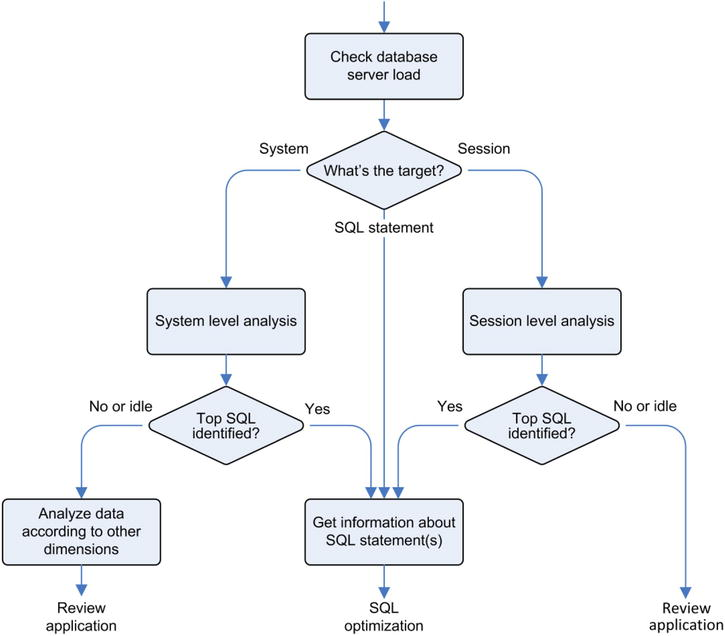

# Tools

## The way

If you know which use-cae peforms badly, focus on it

If not, check this



## Dynamic Performance Views

> Some of them are continuously updated, and others are only updated every 5 seconds.

Type:
- not RAC: v$
- RAC: gv$
- 
### OS

```oracle
 SELECT stat_name, value, comments
  FROM v$osstat
  WHERE stat_name LIKE '%MEMORY_BYTES';
```


### time model 

[V$SESS_TIME_MODEL](https://docs.oracle.com/en/database/oracle/oracle-database/21/refrn/V-SESS_TIME_MODEL.html)

> You can know what **kind** of processing a database engine is doing on behalf of an application by looking at the time model statistics.

Check time spent on behalf of an application
- opening new sessions
- parsing SQL statements
- processing calls with one of the engines (SQL, PL/SQL)

> adding up the time reported by all children does NOT gives their parent's time
> - a specific operation is not exclusively associated to a single child
> - some operations aren’t attributed to any child.

#### All stats

For a session id
```oracle
SELECT 
    ssn.sid, 
    tm.stat_name,
    tm.value time_micros
FROM v$session ssn INNER JOIN v$sess_time_model tm
        ON tm.sid = ssn.sid
WHERE 1=1
    AND ssn.client_identifier = 'profiling'
--  AND ssn.sid = 42
--     AND stat_name = 'DB time'
ORDER BY 
--     tm.value DESC
    tm.stat_name ASC
```

#### DB time

For a session id
```oracle
SELECT 
    ssn.sid, 
    tm.stat_name,
    tm.value time_micros
FROM v$session ssn INNER JOIN v$sess_time_model tm
        ON tm.sid = ssn.sid
WHERE 1=1
    AND ssn.client_identifier = 'profiling'
--  AND ssn.sid = 42
     AND stat_name = 'DB time'
ORDER BY 
    tm.value DESC
```

#### Background time

For a session id
```oracle
SELECT 
    ssn.sid, 
    tm.stat_name,
    tm.value time_micros
FROM v$session ssn INNER JOIN v$sess_time_model tm
        ON tm.sid = ssn.sid
WHERE 1=1
    AND ssn.client_identifier = 'profiling'
--  AND ssn.sid = 42
     AND stat_name = 'background elapsed time'
ORDER BY 
    tm.value DESC
```

#### On each leaf

> the time spent by the database engine waiting on user calls isn’t included
> to know exactly what’s going on, information about wait classes and wait events is necessary.
```oracle
WITH
  db_time AS (SELECT sid, value
              FROM v$sess_time_model
              WHERE sid = 22 -- <= SID HERE
              AND stat_name = 'DB time')
SELECT ses.stat_name AS statistic,
       round(ses.value / 1E6, 3) AS seconds,
       round(ses.value / nullif(tot.value, 0) * 1E2, 1) AS "%"
FROM v$sess_time_model ses, db_time tot
WHERE 1=1
    AND ses.sid = tot.sid
    AND ses.stat_name <> 'DB time'
    AND ses.value > 0
ORDER BY ses.value DESC;
```

>  Because DB time accounts only for the database processing time, the time spent by the database engine waiting on user calls isn’t included. As a result, with only the information provided by the time model statistics, you can’t know whether the problem is located inside or outside the database.

### Identify origin

Set
```oracle
BEGIN
  dbms_session.set_identifier(client_id=>'helicon.antognini.ch');
  dbms_application_info.set_client_info(client_info=>'Linux x86_64');
  dbms_application_info.set_module(module_name=>'session_info.sql',
                                   action_name=>'test session information');
END;
```

Get
```oracle
SELECT client_identifier,
       client_info,
       module AS module_name,
       action AS action_name
FROM v$session
WHERE sid = sys_context('userenv','sid');
```
> The values are the ones that were set at hard parse time in the session that first parsed the SQL statement ! (TOP)

Get executed long queries 


## Debug executed queries (profiler)

### SQL trace

Check timings are available
```oracle
SHOW PARAMETER timed_statistics
ALTER SESSION SET timed_statistics = TRUE
```

If you need to restrict trace file, you can, otherwise:
```oracle
ALTER SESSION SET max_dump_file_size = 'unlimited'
```

#### Capture

##### session level

###### from session itself

Use `ALTER SESSION SET`

Activate (basic)
```oracle
ALTER SESSION SET sql_trace = TRUE
```

Activate (better)
```oracle
ALTER SESSION SET events '10046 trace name context forever, level 12'
```

Disable
```oracle
ALTER SESSION SET events '10046 trace name context off'
```

Or use `dbms_session`

```oracle
BEGIN
  dbms_session.session_trace_enable(waits     => TRUE,
                                    binds     => TRUE,
                                    plan_stat => 'all_executions');
END;
/
```

Or `EXEC` syntax instead of a PL/SQL block
```oracle
    EXEC DBMS_SESSION.SESSION_TRACE_ENABLE();
```

Check
```oracle
SELECT sql_trace, sql_trace_waits, sql_trace_binds, sql_trace_plan_stats
FROM v$session
WHERE sid = sys_context('userenv','sid');
``` 

You'll get
```
SQL_TRACE SQL_TRACE_WAITS SQL_TRACE_BINDS SQL_TRACE_PLAN_STATS
--------- --------------- --------------- --------------------
ENABLED   TRUE            TRUE            ALL EXEC
```

Stop
```oracle
BEGIN
  dbms_session.session_trace_disable;
END;
/
```

###### from another session

Get session id
```oracle
SELECT 'session id is : ' || sys_context('userenv','sessionid')
FROM dual;
```

Or
```oracle
SELECT 
    sss.logon_time
   ,sss.username       --tls_dtf
   ,sss.osuser
   ,sss.program
   ,sss.client_info
  ,sss.*
FROM 
   v$session   sss
WHERE 1=1
  -- AND sss.sid IN (1165,1152,23)
   AND sss.username   =  'DBOFAP'
   AND sss.osuser     =  'fap'
  -- AND sss.status     =   'ACTIVE'
   AND sss.program    LIKE    'sqlplus%'
ORDER BY
   sss.client_info
;
```

Activate
```oracle
dbms_monitor.session_trace_enable(session_id => 127,
                                  serial_num => 29,
                                  waits      => TRUE,
                                  binds      => FALSE,
                                  plan_stat  => 'first_execution')
```

Check if active on this session
```oracle
SELECT sql_trace, sql_trace_waits, sql_trace_binds, sql_trace_plan_stats
FROM v$session
WHERE sid = 127;
```

Disable
```oracle
dbms_monitor.session_trace_disable(session_id => 127,
serial_num => 29)
```

##### client level

Set client identifier
```oracle
CALL dbms_session.set_identifier('client_identifier');
```

Activate
```oracle
dbms_monitor.client_id_trace_enable(client_id => 'client_identifier',
                                    waits     => TRUE,
                                    binds     => TRUE,
                                    plan_stat => 'first_execution')
```

Deactivate
```oracle
dbms_monitor.client_id_trace_disable(client_id => 'client_identifier')
```

##### component level (module, action)

Get service name
```oracle
SELECT * FROM global_name;
```
You may get `FREEPDB1`

Activate
```oracle
dbms_monitor.serv_mod_act_trace_enable(service_name  => 'FREEPDB1',
                                       module_name   => 'mymodule',
                                       action_name   => 'myaction',
                                       waits         => TRUE,
                                       binds         => TRUE,
                                       instance_name => NULL,
                                       plan_stat     => 'all_executions')
```

Deactivate
```oracle
dbms_monitor.serv_mod_act_trace_disable(service_name  => 'FREEPDB1',
                                        module_name   => 'mymodule',
                                        action_name   => 'myaction',
                                        instance_name => NULL)
```


##### database level

Get instance name
```oracle
SELECT instance_name 
FROM gv$instance
```

You mey get `FREE`

Activate
```oracle
dbms_monitor.database_trace_enable(waits         => TRUE,
                                   binds         => TRUE,
                                   instance_name => 'instance_name',
                                   plan_stat     => 'first_execution')
```

Deactivate
```oracle
dbms_monitor.database_trace_disable(instance_name => 'instance_name')
```

##### Sample output
```text
PARSING IN CURSOR #140105537106328 len=139 dep=1 uid=77 oct=3 lid=93 tim=1344867866442114 hv=2959931450 ad='706df490' sqlid='arc3zqqs6ty1u'
SELECT CUST_ID, EXTRACT(YEAR FROM TIME_ID), SUM(AMOUNT_SOLD) FROM SALES WHERE CHANNEL_ID = :B1 GROUP BY CUST_ID, EXTRACT(YEAR FROM TIME_ID)
END OF STMT
PARSE #140105537106328:c=1999,e=1397,p=0,cr=0,cu=0,mis=1,r=0,dep=1,og=1,plh=0, tim=1344867866442113
BINDS #140105537106328:
 Bind#0
  oacdty=02 mxl=22(21) mxlc=00 mal=00 scl=00 pre=00
  oacflg=03 fl2=1206001 frm=00 csi=00 siz=24 off=0
  kxsbbbfp=7f6cdcc6c6e0  bln=22  avl=02  flg=05
  value=3
EXEC #140105537106328:c=7000,e=7226,p=0,cr=0,cu=0,mis=1,r=0,dep=1,og=1,plh=3604305554, tim=1344867866449493
WAIT #140105537106328: nam='Disk file operations I/O' ela= 45 FileOperation=2 fileno=4 filetype=2 obj#=69232 tim=1344867866450319
WAIT #140105537106328: nam='db file sequential read' ela= 59 file#=4 block#=5009 blocks=1 obj#=69232 tim=1344867866450423
...
...
FETCH #140105537106328:c=0,e=116,p=0,cr=0,cu=0,mis=0,r=48,dep=1,og=1,plh=3604305554, tim=1344867867730523
STAT #140105537106328 id=1 cnt=16348 pid=0 pos=1 obj=0 op='HASH GROUP BY (cr=1781 pr=3472 pw=1699 time=1206229 us cost=9220 size=4823931 card=229711)'
STAT #140105537106328 id=2 cnt=540328 pid=1 pos=1 obj=0 op='PARTITION RANGE ALL PARTITION: 1 28 (cr=1781 pr=1773 pw=0 time=340163 us cost=1414 size=4823931 card=229711)'
STAT #140105537106328 id=3 cnt=540328 pid=2 pos=1 obj=69227 op='TABLE ACCESS FULL SALES PARTITION: 1 28 (cr=1781 pr=1773 pw=0 time=280407 us cost=1414 size=4823931 card=229711)'
CLOSE #140105537106328:c=0,e=1,dep=1,type=3,tim=1344867867730655
...
```

#### Activate automatically

Without changing code, using a role
```oracle
CREATE ROLE sql_trace;
 
CREATE OR REPLACE TRIGGER enable_sql_trace AFTER LOGON ON DATABASE
BEGIN
  IF (dbms_session.is_role_enabled('SQL_TRACE'))
  THEN
    EXECUTE IMMEDIATE 'ALTER SESSION SET timed_statistics = TRUE';
    EXECUTE IMMEDIATE 'ALTER SESSION SET max_dump_file_size = unlimited';
    dbms_session.session_trace_enable;
  END IF;
END;
```

#### Get files

Find directory
```oracle
SELECT value FROM v$parameter WHERE name = 'diagnostic_dest';
 
VALUE
---------------
/u00/app/oracle
 
SELECT value FROM v$diag_info WHERE name = 'Diag Trace';
 
VALUE
--------------------------------------------------
/u00/app/oracle/diag/rdbms/dbm11203/DBM11203/trace
```

File path is then 
```oracle
SELECT value
FROM v$diag_info
WHERE name = 'Default Trace File';
 
VALUE
--------------------------------------------------------------------
/u00/app/oracle/diag/rdbms/dba111/DBA111/trace/DBA111_ora_23731.trc
 
SELECT p.tracefile
FROM v$process p, v$session s
WHERE p.addr = s.paddr
AND s.sid = sys_context('userenv','sid');
 
TRACEFILE
--------------------------------------------------------------------
/u00/app/oracle/diag/rdbms/dba111/DBA111/trace/DBA111_ora_23731.trc
```

Filename is `{instance name}_{process name}_{process id}.trc`

PID
```oracle
SELECT spid FROM v$process;
```

Add an identifier to trace file name (suffix)
```oracle
ALTER SESSION SET tracefile_identifier = 'mytrace'
{instance name}_{process name}_{process id}_{tracefile identifier}.trc
```

#### Analyze


### Filter an action : TRCSESS

Will produce another trace file, only with action
```shell
trcsess output=$ACTION.trc action="$ACTION" DBM11203_ora_7978.trc
```

### Profile, actually

#### TKPROF (Transient Kernel Profiler

Run
```shell
tkprof $TRACE.trc $REPORT.txt
```

Run (better) - no explain
```shell
tkprof $TRACE.trc $REPORT.txt sys=no sort=prsela,exeela,fchela
```


Sample output
```text
SELECT CUST_ID, EXTRACT(YEAR FROM TIME_ID), SUM(AMOUNT_SOLD)
FROM SALES
WHERE CHANNEL_ID = :B1
GROUP BY CUST_ID, EXTRACT(YEAR FROM TIME_ID)
 
call     count       cpu    elapsed       disk      query    current        rows
------- ------  -------- ---------- ---------- ---------- ----------  ----------
Parse        1      0.00       0.00          0          0          0           0
Execute      1      0.00       0.00          0          0          0           0
Fetch      164      0.84       1.27       3472       1781          0       16348
------- ------  -------- ---------- ---------- ---------- ----------  ----------
total      166      0.84       1.28       3472       1781          0       16348
 
Misses in library cache during parse: 1
Misses in library cache during execute: 1
Optimizer mode: ALL_ROWS
Parsing user id: 77  (SH)   (recursive depth: 1)
Number of plan statistics captured: 1
 
Rows (1st) Rows (avg) Rows (max)  Row Source Operation
---------- ---------- ----------  ------------------------------------------
     16348      16348      16348  HASH GROUP BY
    540328     540328     540328   PARTITION RANGE ALL PARTITION: 1 28
    540328     540328     540328    TABLE ACCESS FULL SALES PARTITION: 1 28
 
Elapsed times include waiting on following events:
  Event waited on                      Times Waited   Max. Wait  Total Waited
  -----------------------------------  ------------  ----------  ------------
  Disk file operations I/O                        2        0.00          0.00
  db file sequential read                        29        0.00          0.00
  direct path read                               70        0.00          0.00
  asynch descriptor resize                       16        0.00          0.00
  direct path write temp                       1699        0.02          0.62
  direct path read temp                        1699        0.00          0.00
```

#### TVD$XTAT

[Source](https://antognini.ch/category/apmtools/tvdxtat/)

Install

> To fix those problems (TOP):

>  -  As soon as the sort argument is specified, the relationship between SQL statements is lost.
>  -  Data is provided only in aggregated form. Consequently, useful information is lost.
>  -  No information about bind variables is provided.
>  -  Idle wait events (for example, SQL*Net message from client) taking place during the execution of a SQL statement aren’t accounted for in the elapsed time shown by TKPROF. As a result, when SQL statements are sorted according to their elapsed time, the output might be misleading or, in extreme cases, very time consuming if not nearly impossible to interpret.
>  -  When a trace file doesn’t contain the text of a SQL statement (specifically, the text delimited between the PARSING IN CURSOR and END OF STMT keywords), TKPROF doesn’t report the details about the SQL statement; it just accounts for the resource utilization in the summary at the end of the output file. Note that one case in which the text of a SQL statement isn’t stored in the trace file is when SQL trace is activated after the execution has already been started.

```shell
tvdxtat -i $TRACE.trc -o $REPORT.txt –s no –w yes -t text
```

#### Method-R


Instrumentation VS profiling

## Debug executed code (PL/SQL profiler)

### dbms_profiler (line-level)
Prefer dbms_hprof, unless you need to debug each line of your procedure


#### Create table

```oracle
CONNECT / AS SYSDBA
@?/rdbms/admin/proftab.sql
 
CREATE PUBLIC SYNONYM plsql_profiler_runs FOR plsql_profiler_runs;
CREATE PUBLIC SYNONYM plsql_profiler_units FOR plsql_profiler_units;
CREATE PUBLIC SYNONYM plsql_profiler_data FOR plsql_profiler_data;
CREATE PUBLIC SYNONYM plsql_profiler_runnumber FOR plsql_profiler_runnumber;
 
GRANT SELECT, INSERT, UPDATE, DELETE ON plsql_profiler_runs TO PUBLIC;
GRANT SELECT, INSERT, UPDATE, DELETE ON plsql_profiler_units TO PUBLIC;
GRANT SELECT, INSERT, UPDATE, DELETE ON plsql_profiler_data TO PUBLIC;
GRANT SELECT ON plsql_profiler_runnumber TO PUBLIC;
```

Start profiling
```oracle
dbms_profiler.start_profiler
dbms_profiler.stop_profiler routine
dbms_profiler.pause_profiler
dbms_profiler.resume_profiler
```

Get results
```oracle
SELECT s.line,
       round(ratio_to_report(p.total_time) OVER ()*100,1) AS time,
       total_occur,
       s.text
FROM all_source s,
     (SELECT u.unit_owner, u.unit_name, u.unit_type,
             d.line#, d.total_time, d.total_occur
      FROM plsql_profiler_units u, plsql_profiler_data d
      WHERE u.runid = 1
      AND d.runid = u.runid
      AND d.unit_number = u.unit_number) p
WHERE s.owner = p.unit_owner (+)
AND s.name = p.unit_name (+)
AND s.type = p.unit_type (+)
AND s.line = p.line# (+)
AND s.owner = user
AND s.name = 'PERFECT_TRIANGLES'
AND s.type IN ('PROCEDURE', 'PACKAGE BODY', 'TYPE BODY')
ORDER BY s.line;
```
PL/SQL Developer

### dbms_hprof (call-level, hierarchical)

Hierarchical PROFiler

Small overhead
No privileges

#### Install

```oracle
CONNECT / AS SYSDBA
@?/rdbms/admin/dbmshptab.sql

CREATE PUBLIC SYNONYM dbmshp_runs FOR dbmshp_runs;
CREATE PUBLIC SYNONYM dbmshp_function_info FOR dbmshp_function_info;
CREATE PUBLIC SYNONYM dbmshp_parent_child_info FOR dbmshp_parent_child_info;
CREATE PUBLIC SYNONYM dbmshp_runnumber FOR dbmshp_runnumber;

GRANT SELECT, INSERT, UPDATE, DELETE ON dbmshp_runs TO PUBLIC;
GRANT SELECT, INSERT, UPDATE, DELETE ON dbmshp_function_info TO PUBLIC;
GRANT SELECT, INSERT, UPDATE, DELETE ON dbmshp_parent_child_info TO PUBLIC;
GRANT SELECT ON dbmshp_runnumber TO PUBLIC;
```

#### Activate on session level

Begin
```oracle
BEGIN
      dbms_hprof.start_profiling(location => 'PLSHPROF_DIR',
                                 filename => 'dbms_hprof.trc');
END;
/
```

End
```oracle
BEGIN
      dbms_hprof.stop_profiling();
END;
/
```

Or trigger on logon
```oracle
CREATE TRIGGER start_hprof_profiler AFTER LOGON ON DATABASE
BEGIN
  IF (dbms_session.is_role_enabled('HPROF_PROFILE'))
  THEN
    dbms_hprof.start_profiling(
      location => 'PLSHPROF_DIR',
      filename => 'dbms_hprof_'||sys_context('userenv','sessionid')||'.trc'
    );
  END IF;
END;
/
 
CREATE TRIGGER stop_hprof_profiler BEFORE LOGOFF ON DATABASE
BEGIN
  IF (dbms_session.is_role_enabled('HPROF_PROFILE'))
  THEN
    dbms_hprof.stop_profiling();
  END IF;
END;
/
```

#### Process

##### Command-line
```shell
plshprof -output dbms_hprof dbms_hprof.trc
```

##### tables
Load
```oracle
SELECT dbms_hprof.analyze(location => 'PLSHPROF_DIR',
                          filename => 'dbms_hprof.trc') AS runid
FROM dual;
```

Query
```oracle
SELECT * FROM dbmshp_runs;
SELECT * FROM dbmshp_function_info;
SELECT * FROM dbmshp_parent_child_info;
```

Level 1: SQL or PL/SQL ?
```oracle
SELECT sum(function_elapsed_time)/1000 AS total_ms,
       100*ratio_to_report(sum(function_elapsed_time)) over () AS total_percent,
       sum(calls) AS calls,
       100*ratio_to_report(sum(calls)) over () AS calls_percent,
       namespace AS namespace_name
FROM dbmshp_function_info
WHERE runid = 1
GROUP BY namespace
ORDER BY total_ms DESC;
```

Level 2: which procedure ?
```oracle
SELECT sum(function_elapsed_time)/1000 AS total_ms,
       100*ratio_to_report(sum(function_elapsed_time)) over () AS total_percent,
       sum(calls) AS calls,
       100*ratio_to_report(sum(calls)) over () AS calls_percent,
       namespace,
       nvl(nullif(owner || '.' || module, '.'), function) AS module_name,
       type
FROM dbmshp_function_info
WHERE runid = 1
GROUP BY namespace, nvl(nullif(owner || '.' || module, '.'), function), type
ORDER BY total_ms DESC;
```

Level 3: callees of procedure, eg. functions
```oracle
SELECT lpad(' ', (level-1) * 2) || nullif(c.owner || '.', '.') ||
       CASE WHEN c.module = c.function
            THEN c.function
            ELSE nullif(c.module || '.', '.') || c.function END AS function_name,
       pc.subtree_elapsed_time/1000 AS total_ms,
       pc.function_elapsed_time/1000 AS function_ms,
       pc.calls AS calls
FROM dbmshp_parent_child_info pc,
     dbmshp_function_info p,
     dbmshp_function_info c
START WITH pc.runid = 1
AND p.runid = pc.runid
AND c.runid = pc.runid
AND pc.childsymid = c.symbolid
AND pc.parentsymid = p.symbolid
AND p.symbolid = 1
CONNECT BY pc.runid = prior pc.runid
AND p.runid = pc.runid
AND c.runid = pc.runid
AND pc.childsymid = c.symbolid
AND pc.parentsymid = p.symbolid
AND prior pc.childsymid = pc.parentsymid
ORDER SIBLINGS BY total_ms DESC;
```

#### GUI
Use SQL Developer

### Diagnostics Pack 
Enterprise Edition is pre-requisite (Standard Edition won't work)

### Tuning Pack
Diagnostics Pack  is pre-requisite

## Stats Pack

## Application Workload Report (AWR)

## Enterprise Manager