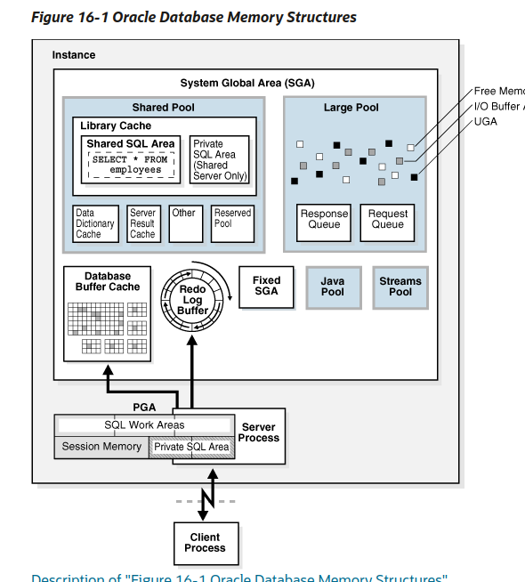
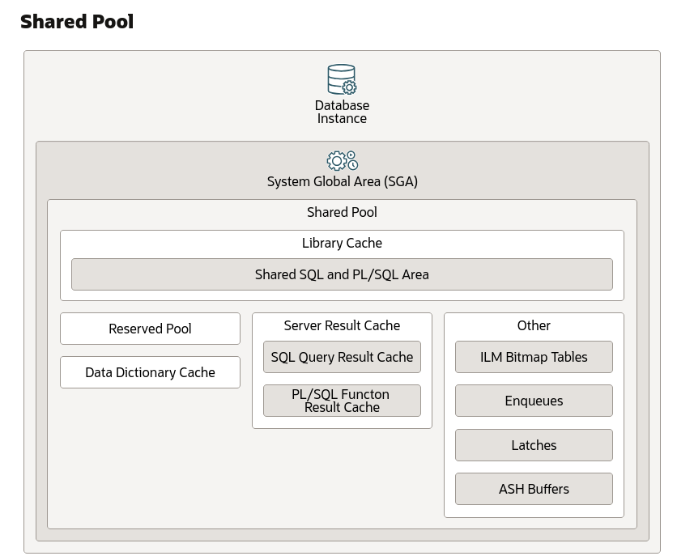

# Memory

## Overview

> MEMORY_TARGET specifies the Oracle system-wide usable memory: SGA + PGA.
> Total memory usage can grow beyond the value of MEMORY_TARGET(eg. PL/SQL tables) , as long as memory is available at the operating system level.

[Diagrams](https://docs.oracle.com/en/database/oracle/oracle-database/23/dbiad/db_dbinstance.html)

> When an instance is started, Oracle Database allocates a memory area and starts background processes.

> The memory area stores information such as the following:
>    - Program code
>    - Information - connected session, even if it is not currently active
>    - Information - needed during program execution, eg. the current state of a query from which rows are being fetched
>    - Information - such as lock data - shared and communicated among processes
>    - Cached data - data blocks and redo records, that also exists on disk

https://docs.oracle.com/en/database/oracle/oracle-database/21/cncpt/memory-architecture.html

## Program Global Area  - PGA

Shared memory area for a user server process.
Used for temporary storage and work areas. 

Oracle uses the PGA and temp tablespaces to work to get to a result set which is passed back to the client, then the PGA for the session is freed.

`pga_aggregate_target` : target aggregate (available to all server processes attached to the instance)

`pga_aggregate_limit` :  limit. If exceeded, the sessions that are using the most untunable memory will be terminated.
default: 10 MB or 20% of the size of the SGA

https://docs.oracle.com/en/database/oracle/oracle-database/21/refrn/PGA_AGGREGATE_LIMIT.html

## System Global Area - SGA

> The SGA is a group of shared memory structures,:
> - data
> - control information for one Oracle Database instance. 
> 
> All server and background processes share the SGA. 
> Examples of data stored in the SGA include cached data blocks and shared SQL areas.

SQL areas are aged out of the shared pool by way LRU algorithm.

Available for all the user.

Memory structure on the server that contains :
- pools to hold code, 
- SQL, 
- classes 
- caches to hold data. 

So when a client sends a query to the server, the code and data sits in the SGA to get processed by the RDBMS on the server.

### shared pool

https://docs.oracle.com/en/database/oracle/oracle-database/23/dbiad/db_sharedpool.html

> The shared pool is responsible for caching various types of program data
> - parsed SQL
> - system parameters
> - data dictionary information
> - enqueues, latches, active session history (ASH) buffers
> 
> It contains the "reserved pool" is a memory area can allocate large contiguous chunks of memory, thereby avoiding running out of contiguous memory because of fragmentation on large objects (over 5 KB)

### large pool

> optional memory area intended for memory allocations that are larger than is appropriate for the shared pool:
> - Message buffers used in parallel execution
> - Buffers for Recovery Manager (RMAN) I/O slaves
> - Buffers for deferred inserts (inserts with the MEMOPTIMIZE_WRITE hint)

> The large pool does not have an LRU list. When the database allocates large pool memory to a database session, this memory is not eligible to be released unless the session releases

### buffer cache 

Stores the copies of the data blocks that are read from the database discs. 

> Optimize physical I/O
> - The database updates data blocks in the cache and stores metadata about the changes in the redo log buffer. After a COMMIT, the database writes the redo buffers to the online redo log but does not immediately write data blocks to the data files. Instead, database writer (DBW) performs lazy writes in the background.
> - Keep frequently accessed blocks in the buffer cache and write infrequently accessed blocks to disk

## User Global Area - UGA

> The UGA is memory associated with a user session.
