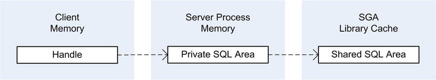
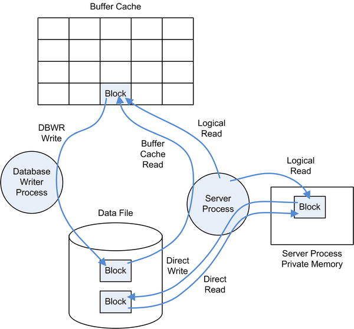

# Lexicon

> When your analysis points to a small number of SQL statements or a limited piece of PL/SQL code, you’ve found the part of your application that needs optimization, and there’s likely a straightforward way of fixing it. 

> Otherwise, a response time distributed over a large number of SQL statements or over a large part of the PL/SQL code usually means the problem is due to design decisions; complete reengineering could be necessary. 

> If the design itself isn’t a problem, then it’s likely that the machine running the application is undersized.

LGWR :lg writer, write data to redolog files

SQL trace

selectivity: rows returned / rows total - strong/weak [0;1]   
cardinality (operation) = selectivity * num_rows = rows returned

access path

bind variable
>  from a security point of view, bind variables mitigate the risk of SQL injection
> from a performance point of view, bind variables introduce both an advantage and a disadvantage
> - they allow the sharing of parent cursors, then avoid hard parses 
> - crucial information is hidden from the query optimizer (eg. for range comparison predicates:  BETWEEN, >, < )

> In summary, to increase the likelihood that the query optimizer will generate efficient execution plans, you shouldn’t use bind variables. Bind variable peeking might help. Unfortunately, it’s sometimes a matter of luck whether an efficient execution plan is generated. The only exception is when adaptive cursor sharing automatically recognizes the problem.


> For cursors that can be shared, you should not use bind variables if one of the preceding three conditions is met.
    - the query optimizer has to check whether a value is outside the range of available values (that is, lower than the minimum value or higher than the maximum value stored in the column)
    - a predicate in the WHERE clause is based on a range condition (for example, HIREDATE >'2009-12-31')
    - query optimizer makes use of histograms

> Nevertheless, if SQL statements process
> - little data  (web app, OLTP) : use bind (as parsing is expensive)
> - lot of data (DWH) : do not use bind 

bind variable peeking
> before generating an execution plan, the query optimizer peeks at the values of bind variables at first execution

hints

parsing 

lock/latch

hard parse
An execution plan has to be created, not retrieved - cause overhead
> In practice, it’s quite common to see more hard parses caused by nonshared parent cursors than nonshared child cursors. In fact, more often than not, there are few child cursors for each parent cursor. If the parent cursors can’t be shared, it almost always means that the text of SQL statements changes constantly. This happens if either the SQL statements are dynamically generated by the application or literals are used instead of bind variables. In general, dynamically generated SQL statements can’t be avoided. On the other hand, it’s usually possible to use bind variables. Unfortunately, it isn’t always good to use them

parent cursor sharing
> several SQL statements share the same parent cursor (thereby avoid hard parses.) if 
> - their text is exactly the same.
> - when cursor sharing is enabled, the database engine can automatically replace the literals used in SQL statements with bind variables

child cursor sharing
> several SQL statements are able to share the same child cursor if 
> - they share the same parent cursor 
> - their execution environments are compatible (eg. optimizer_mode = all_rows or nls_sort = binary or bind variable size 22/32/128)

adaptive cursor sharing : bind-aware cursor sharing

> By default, cursors are created non–bind aware
> At least one execution (or many executions when there were a high number of efficient executions), has to be inefficient before going bind-ware BUT using bind_aware hint

>  Bind aware cursors necessitate, for every parse, that the query optimizer performs an estimation of the selectivity of their predicates. Because of that, adaptive cursor sharing is sometimes not enabled by the database engine. There are two common cases to consider:
> - SQL statements containing more than 14 bind variables
> - the query optimizer is unable to correctly estimate the selectivity (implicit datatype conversion, no statistics)

> To decide  when a cursor is made bind aware (and therefore use adaptive cursor sharing, it compares expected selectivity with actual selectivity in sql_cs_histogram using buckets)


execution environment
(eg. optimizer_mode = all_rows)


cursor 
> A cursor is a handle  that references a private SQL area with an associated shared SQL area

private SQL area
> A private SQL area stores data such as bind variable values and query execution state information. As its name suggests, a private SQL area belongs to a specific session. The session memory used to store private SQL areas is called user global area (UGA).

shared SQL area
- parent cursor : text of the SQL statement
- child cursor :  execution environment and the execution plan. 
> A shared SQL area can be used by several sessions, and therefore it’s stored in the library cache.
> Obviously, the aim of storing them in a shared memory area is to allow their reutilization and thereby avoid hard parses.

SGA library cache




block I/O

Types :
- logical reads: acces a block that is either in the buffer cache or in the private memory of the process
- buffer cache reads: it needs a block that isn’t in the buffer cache yet (so it read from the data file to buffer cache)
- DBWR writes: DBWR write dirty block on disk data file
- direct read: read blocks from a data file (skip loading in the buffer cache) to the private memory of the process.
- direct write: write blocks from private memory of the process to the data file (skip loading in the buffer cache and DBWR write) 
- smart scans:  exadata storage (offload)


Physical reads :
- buffer cache read
- direct read
- (no logical read, so not in process memory)

Physical writes :
- direct write
- DBWR write

  


DBWR : database writer process (which is a background process) is responsible for storing the modified blocks (also called dirty blocks) in the data files.

## concurrency

> latches and enqueues are both types of locks.

> latches are lightweight serialization devices (busy wait)
> we try to get a latch, spin for a bit and try again. so when getting a latch, we try and try and try -- we are not told that the latch is available, we keep trying to get it (eg: not necessary a first come, first serve lock). we use latches to serialize access to in memory data structures typically (like SGA data structures)

> enqueues are heavyweight serialization devices (sleep)
> if we cannot get an enqueue, we "go to sleep" and when the enqueue is available -- we are told about it in a first come, first serve manner. We use enqueues to perform row level locking for example.

> A semaphore is an operating system supplied serialization device that one might use to implemented latching or enqueues.
>
> So, latches and enqueues are types of locks
> Semaphores a programming device one might use to IMPLEMENT latching and enqueuing.

https://asktom.oracle.com/ords/asktom.search?tag=locks-latches

latch

> Latches are locks designed to be held for extremely short periods of time¿for example, the time it takes to modify an in-memory data structure. They are used to protect certain memory structures, such as the database block buffer cache or the library cache in the shared pool


synchronization points

debugging event
> Debugging events enable specific code paths


shared server

dedicated server

prefetch size 

unaccounted-for time
total_time - sum (operation) = waiting for a CPU time (high if CPU starvation)

process time
- running on a CPU
- waiting for the fulfillment of a request (eg I/O)
- waiting for a CPU (run queue) <= not instrumented

wait event
- db file sequential read : single-block reads
- [db file scattered read](https://docs.oracle.com/en/database/oracle/oracle-database/21/refrn/descriptions-of-wait-events.html#GUID-41BE84A5-6DCD-440E-BC84-55D78C750B2B) :  multiblock reads 
- direct path write temp , direct path read temp : spill into the temporary tablespace
- SQL*Net message to client :
- SQL*Net message from client :

service name:
>  logical name associated to a database, configured through the service_names initialization parameter, or through the dbms_service package
> One database may have multiple service names.

## optimizer

access paths, eg. , index scans

## langage

lateral

disjunctive predicates : `OR`

query block: eg. a sub-query. Simple SQL statements have a single query block

inline view:
```oracle
SELECT *
FROM (SELECT t1.*
      FROM t1, t2
      WHERE t1.id = t2.t1_id) t12,
```

semi-join (IN, EXISTS)

anti-join (NOT IN, NOT EXISTS)