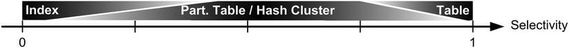
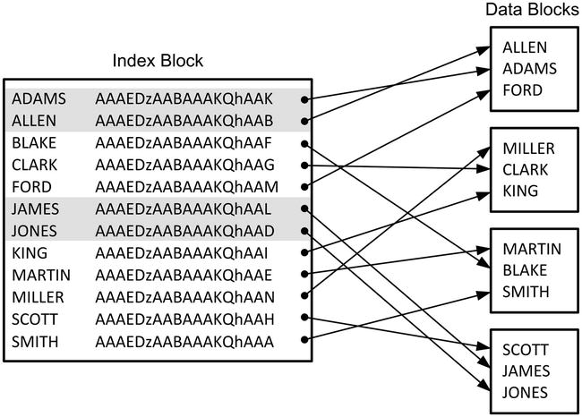
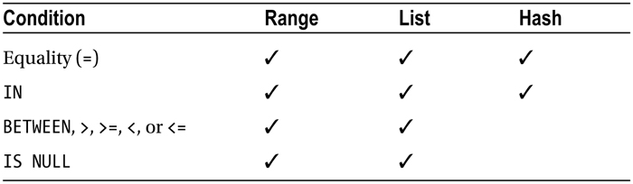

# Data access

## efficient access spath

> The most efficient access path is able to process the data by consuming the least amount of resources. 
> Therefore, to recognize whether an access path is efficient, you have to recognize whether the amount of resources used for its processing is acceptable. 
> To do so, it’s necessary to define both: 
> - how to measure the utilization of resources; 
> - what “acceptable” means;
> - how much effort is needed to implement a check.

> Keep in mind that this section focuses on efficiency, not on speed alone. It’s essential to understand that the most efficient access path isn’t always the fastest one. With parallel processing, it’s sometimes possible to achieve a better response time even though the amount of resources used is higher. Of course, when you consider the whole system, the fewer resources used by SQL statements (in other words, the higher their efficiency is), the more scalable, and faster, the system is. This is true because, by definition, resources are limited.

> In an ideal world, you would like to measure the resource consumption by considering all four main types of resources used by the database engine: CPU, memory, the disk, and the network. 
> Certainly, this can be done, but unfortunately getting and assessing all these figures takes a lot of time and effort and can usually be done only for a limited number of SQL statements in an optimization session. 

> As a first approximation, the amount of resources used by an access path is acceptable when it’s proportional to the amount of returned rows (that is, the number of rows that are returned to the parent operation in the execution plan). In other words, when few rows are returned, the expected utilization of resources is low, and when lots of rows are returned, the expected utilization of resources is high. Consequently, the check should be based on the amount of resources used to return a single row.

> It’s, in fact, not uncommon at all to see long-running SQL statements that use a modest amount of memory and are without disk or network access.

## assessing efficiency

### a single metric: logical reads

> Fortunately, there’s a single database metric, which is very easy to collect, that can tell you a lot about the amount of work done by the database engine: the number of logical reads
> — that is, the number of blocks that are accessed during the execution of a SQL statement.

> There are five good reasons for this
> - a logical read is a CPU-bound operation and, therefore, reflects CPU utilization very well.
> - a logical read might lead to a physical read, and therefore, if you reduce the number of logical reads, you likely reduce the disk I/O operations as well. 
> - a logical read is an operation subject to serialization. Because you usually have to optimize for a multiuser load, minimizing the logical reads is good for avoiding scalability problems.
> - the number of logical reads is readily available at the SQL statement and execution plan operation levels, in both SQL trace files and dynamic performance views.  
> - the number of logical reads is independent of the load to which the CPU and the disk I/O subsystem are subject.

TLDR: 
 - Logical reads are very good at approximating overall resource consumption
 - Check should be based on the amount of resources used to return a single row.


> You can concentrate (at least for the first round of optimization) on access paths that have a high number of logical reads per returned rows. 
> The following are generally considered good “rules of thumb”: access paths that lead to (logical reads / returned row)
> -  < 5 : good.
>  -  10–15 : acceptable.
> -  >= 20 : inefficient
     
> To check the number of logical reads per row:
> - explain plan : logical reads `Buffers`/  rows returned `A-Rows`, eg. 28/3 = 10 : acceptable
> - SQL trace :  logical reads `cr`/  rows returned `Rows`, eg. 28/3 = 10 : acceptable

```text
-----------------------------------------------------------------
| Id  | Operation                   | Name   | A-Rows | Buffers |
-----------------------------------------------------------------
|   0 | SELECT STATEMENT            |        |    3   |     28  |
|*  1 |  TABLE ACCESS BY INDEX ROWID| T      |  **3** |   **28**|
|*  2 |   INDEX RANGE SCAN          | T_N2_I |     24 |       4 |
-----------------------------------------------------------------

Rows     Row Source Operation
-------  ---------------------------------------------------
  **3**  TABLE ACCESS BY INDEX ROWID T (**cr= 28** pr=0 pw=0 time=80 us)
     24   INDEX RANGE SCAN T_N2_I (cr=4 pr=0 pw=0 time=25 us)(object id 39684)
```

> You must consider the figures at the access-path level only, not for the whole SQL statement. 
> In fact, the figures at the SQL statement level might be misleading.

### pitfalls

> While examining the number of logical reads, you must be aware of two pitfalls that might distort the figures.

#### read consistency

> For every SQL statement, the database engine has to guarantee the consistency of the processed data. For that purpose, based on current data blocks and undo blocks, consistent copies of data blocks might be created at runtime. 
> To execute such an operation, several logical reads are performed. 
> Therefore, the number of logical reads performed by an access path operation is strongly dependent on the number of blocks that have to be reconstructed. 
> Eg, for the same query and rows, 354 logical reads may be performed instead of 28
> That effect is because of another session that modified the blocks needed to process this query. 
> Because the changes weren’t committed at the time the query was started, the database engine had to reconstruct the blocks.


#### row prefetching

> row prefetching: when a client retrieves data from a database, it will do it:
> - not row by row
> - but retrieving several rows at the same time. 
 
> this is good, as from a performance point of view, you should always avoid row-based processing.

> With a full table scan, there are two extremes :
> - row prefetching is set to 1 : approximately one logical read per returned row is performed
> - row prefetching is set to a number greater than the number of rows stored in each table’s block : the number of logical reads is close to the number of the table’s blocks.

> In SQL*Plus, you manage the number of prefetched rows through the arraysize system variable (default is 15). Given the dependency of the number of logical reads on row prefetching, whenever you execute a SQL statement for testing purposes in a tool such as SQL*Plus, you should carefully set row prefetching like the application does. 
> The tool you use for the tests should prefetch the same number of rows as the application. Failing to do so may cause severely misleading results.

Aggregation

> When blocking operations (for example, aggregation operations) are executed, the SQL engine uses row prefetching internally. Every time it accesses a block, it extracts all rows contained in it (regardless of the row prefetching setting).  
> As a result, the number of logical reads of an access path is very close to the number of blocks.

## cause of inefficient access paths

> There are several main causes of inefficient access paths:
> - no suitable access structures (for example, indexes) are available.
> - a suitable access structure is available, but the syntax of the SQL statement doesn’t allow the query optimizer to use it.
> - the table or the index is partitioned, but no pruning is possible. As a result, all partitions are accessed.
> - the table or the index, or both, aren’t suitably partitioned.
> - when the query optimizer makes wrong estimations because of a lack of object statistics, object statistics that aren’t up-to-date, or a wrong query optimizer configuration is in place.


partitioning-pruning:
> The reason for using partitioning is to take advantage of the query optimizer’s ability to exclude the processing of partitions that contain processing-irrelevant data a priori.


## solutions

### overview

> The objective is to minimize the number of logical reads, to use the access path that accesses fewer blocks.

> To reach this objective, it may be necessary to : 
> - add new access structures (for example, indexes);
> - change the physical layout (for example, partition some tables or their indexes).

> It’s possible to classify SQL statements (or better, data access operations) in two main categories with regard to selectivity:
> - operations with weak selectivity
> - operations with strong selectivity

> The selectivity is important because :
> - the access structures that work well with operations with very weak selectivity; 
> - work badly for operations with very strong selectivity (and vice versa).

> It’s absolutely wrong to say that selectivity up to 0.1 is necessarily strong, and above this value, it’s necessarily weak. 
> In spite of this, it may be said that, in practice, the limit commonly ranges between 0.05 and 0.25 (for selectivity to be strong). 
> Only for values close to 0 or 1 can you be certain.

3 situations:
-  strong selectivity : use index (and rowid or hash cluster)
-  in between: partitioned tables and hash clusters
-  weak selectivity : reading the whole table (full-table scan)



### to return a single / a few rows (strong selectivity)

3 access structure :
- heap table with a primary key ;
- index-organized table ;
- single-table hash cluster that has the primary key as the cluster key.

3 dataset:  10, 10,000, and 1,000,000 rows

Access on primary key

> Four main facts:
> - all access structures, a single logical read is performed through a rowid
> - heap table, at least two logical reads are necessary: 
>   - one for the index
>   - one for the table
>   - as the number of rows increases, the height of the index increases, and the number of logical reads increases as well.
> - index-organized table: requires one less logical read than through the heap table.
> - single-table hash cluster: not only is the number of logical reads independent of the number of rows, but in addition, it always leads to a single logical read.

> For retrieving **a single row**, a regular table (with an index) is the **least** efficient access structure. 
> However, they are the most commonly used because you can take advantage of the other access structures only in specific situations.0


##### ROWID accces

> The most efficient way to access a row is to directly specify its rowid in the WHERE clause. However, to take advantage of that access path, you have to get the rowid first, store it, and then reuse it for further accesses. In other words, it’s a method that can be considered only if a row is accessed at least two times. In practice, this is something that happens quite frequently when SQL statements have strong selectivity. For example, applications used to manually maintain data (in other words, not batch jobs) commonly access the same rows at least two times—at least once to show the current data and at least a second time to store the modifications. In such cases, it makes sense to carefully take advantage of the efficiency of rowid accesses.

##### index access 

> Index accesses are by far the most often used access paths for SQL statements with strong selectivity. To take advantage of them, you have to to apply at least one of the restrictions present in the WHERE clause or a join condition through an index. To do that, it’s essential to not only index the columns that provide strong selectivity but also to understand which type of conditions might be applied efficiently through an index. The database engine supports different types of indexes. Before describing the properties and access paths supported by B-tree and bitmap indexes in detail, it’s important to discuss the clustering factor or, in other words, why the distribution of data impacts the performance of an index scan (see

###### clustering factor

> the clustering factor indicates how many adjacent index keys don’t refer to the same data block in the table. 
> If the whole table is accessed through an index and in the buffer cache there’s a single buffer to store the data blocks, the clustering factor is the number of physical reads performed against the table. For example, the clustering factor of the index  10 (notice that there are 12 rows and only two adjacent index keys, which are highlighted, refer to the same data block).



###### B-tree or bitmap

| Feature                                                          | B-tree | Bitmap |
|------------------------------------------------------------------|--------|--------|
| Primary and unique key                                           | ✓      |        |
| Row-level locking                                                | ✓      |        |
| Efficient combination of several indexes                         |        | ✓      |
| Global indexes and non-partitioned indexes on partitioned tables | ✓      |        |


> Note that the selectivity or the number of distinct keys of the index is irrelevant to choose between B-tree and bitmap indexes. This is true despite the fact that many books and papers about bitmap indexes contain advice.

| Condition                                    | B-tree | Bitmap |
|----------------------------------------------|--------|--------|
| Equality (=)                                 | ✓      | ✓      |
| IS NULL                                      | ✓ *    | ✓      |
| Range (BETWEEN, &gt;, &gt;=, &lt; and &lt;=) | ✓      | ✓      |
| IN                                           | ✓      | ✓      |
| LIKE                                         | ✓      | ✓      |
| Inequality (!=, &lt;&gt;) and IS NOT NULL    |        | ✓ †    |


*Never applicable to single-column indexes; applicable to composite indexes only if either another condition leading to an index range scan is specified or the NULL values are guaranteed to be stored in the index.

†Applicable only when several bitmaps are combined.

###### partial indexes

> Using them in the right situations can save a lot of disk space that would be unnecessarily allocated.


> When an index is created, it’s possible to specify whether the indexing property has to be observed (INDEXING PARTIAL) or not (INDEXING FULL, this is the default value). 
> The following SQL statement shows how to create a partial index:

```oracle
CREATE INDEX i ON t (d) INDEXING PARTIAL
```

> The key requirement for the use of partial indexes is that the data has to be stored in a partitioned table.

##### index-organized table access 

> One particular way to achieve an index-only scan is to create an index-organized table. The central idea of this kind of table is, in fact, to avoid having a table segment at all. Instead, all data is stored in an index segment based on the primary key. It’s also possible to store part of the data in an overflow segment. By doing so, however, the benefit of using an index-organized table vanishes (unless the overflow segment is rarely accessed). The same happens when a secondary index (that is, another index in addition to the primary key) is created: two segments need to be accessed. Hence, there’s no benefit in using it. 
> For these reasons, you should consider using index-organized tables only when two requirements are met
> First, the table is normally accessed through the primary key. 
> Second, all data can be stored in the index structure (a row can take at most 50 percent of a block). 

> A row in an index-organized table isn’t referenced by a physical rowid. Instead, it’s referenced by a logical rowid. This kind of rowid is composed of two parts: first, a guess referencing the block that contains the row (key) at the time it was inserted, and second, the value of the primary key. A visit to the index-organized table by logical rowid at first follows the guess, hoping to find the row still in the insert-time block, but because the guess isn’t updated when block splits occurs, it might become stale when INSERT and UPDATE statements are executed. If the guess is correct, with a logical rowid, it’s possible to access one row with a single logical read. In case the guess is wrong, the number of logical reads would be equal to or greater than two (one for the useless access through the guess, plus the regular access with the primary key). Naturally, to have the best performance, it’s capital to have correct guesses. To assess the correctness of such guesses, the pct_direct_access column, which is updated by the dbms_stats package, is available in the user_indexes view.

##### single-table hash cluster access

> In practice, too few databases take advantage of single-table hash clusters. As a matter of fact, when they’re correctly sized and accessed through an equality condition on the cluster key, they provide excellent performance. There are two reasons for this. First, they need no separate access structure (for example, an index) to locate data—in fact, the cluster key is enough to locate it. Second, all data related to a cluster key is clustered together. These two advantages were also demonstrated by the tests summarized in Figures 13-3 and 13-4 earlier in this chapter.

> Single-table hash clusters are dedicated to the implementation of lookup tables that are frequently (ideally, always) accessed through a specific key. Basically, this is the same utilization you can get from index-organized tables. However, there are some major differences between the two. The crucial disadvantage is that single-table hash clusters need to be accurately sized to take advantage of them.


| Advantages                                                                        | Disadvantages                                                     |
|-----------------------------------------------------------------------------------|-------------------------------------------------------------------|
| Better performance (if accessed through cluster key and sizing is done correctly) | Careful sizing needed to avoid hash collisions and waste of space |
| Cluster key might be different from primary key                                   | Partitioning not supported                                        |
|                                                                                   | LOB columns not supported                                         |


### to return many rows (weak selectivity)


> To process data efficiently, SQL statements with weak selectivity have to use either a full table scan or a full partition scan. But in plenty of situations, only full table scans come into play.
> Not all tables will be partitioned in practice. A table might be partitioned by only a limited number of columns. 
> As a result, even if a table is partitioned, not all SQL statements that reference it will be able to take advantage of partitioning, unless all of them reference the partitioning key(s), which is usually not the case in practice.

>In particular situations, both full table scans and full partition scans might be avoided by replacing them with full index scans. 
> In such cases, the idea is to take advantage of indexes not for the purpose of searching for particular values, but simply because they’re smaller than tables.

##### full table scan

> It’s possible to perform a full table scan on all heap tables. Because there are no particular requirements for doing this type of scan, on occasion it may be the only access path possible.

> The minimum number of logical reads performed by a full table scan depends on the number of blocks, not on the number of rows. 
> This can lead to suboptimal performance if the table contains a lot of empty or almost-empty blocks. Clearly, a block has to be read to know whether it contains data. 
> One of the most common scenarios that can lead to a table with a lot of sparsely populated blocks is when tables are subject to more deletes than inserts.

##### full partition scan

> When the selectivity is very weak (that is, close to 1), full table scans are the most efficient way to access data. 
> As soon as the selectivity decreases, many blocks are unnecessarily accessed by full table scans. 
> Because the use of indexes isn’t beneficial with weak selectivity, partitioning is the most common option used to reduce the number of logical reads. 
> The reason for using partitioning is to take advantage of the query optimizer’s ability to exclude the processing of partitions that contain processing-irrelevant data a priori. 



> Choosing the partition key and the partitioning method is probably the most important decision you have to make while working on the design of a partitioned table. The objective is to take advantage of partition pruning to efficiently process as many SQL statements as possible. In addition, one partition should ideally contain only the data you expect to be processed by a single SQL statement. For example, if there are frequent SQL statements processing data by the day, you should partition by the day. Or, if there are frequent SQL statements that process data by country, you should partition the data by country. If you do this incorrectly, you’ll never be able to take advantage of partition pruning. The following four characteristics of your application have to be considered very carefully, because they’re the ones that impact the partitioning strategy the most:

    What columns the restrictions are expected to be applied on and with what frequency
    What kind of data will be stored in those columns
    What the SQL conditions used in those restrictions will be
    Whether data must be regularly compressed or purged and what criterion to base the processing on

> The first and the fourth are essential for choosing the partition key. The second and the third are for choosing the partitioning method. Let’s discuss them in detail.

> Knowing which columns the restrictions are applied on is essential because no partition pruning is possible if no restriction is applied to the partition key. In other words, based on this criterion, you restrict the choice between a limited number of columns. In practice, it’s quite common for several, possibly very different, restrictions to be applied by different SQL statements. Therefore, you must know the frequency of utilization of the different SQL statements as well. In this way, you can decide which restrictions are the most important to optimize. In any case, you should consider only those restrictions that have weak selectivity. In fact, restrictions with strong selectivity can be optimized with other access structures (for example, indexes).

> Once the columns to be potentially used in the partition key are known, it’s time to take a look at the data they store. The idea is to find out which partitioning method would be applicable to them. For that, it’s essential to recognize two things. First, only range and list partitioning allow the grouping together of “related” data (for example, all of July’s sales or all European countries) or an exact mapping of specific values with specific partitions. Second, each partitioning method is suitable only for a very specific kind of data:

    Range is suitable for values that are sequential by nature. Typical examples are timestamps and numbers generated by a sequence.
    List is suitable when the number of distinct values is both well known and limited in number. Typical examples are all kinds of status information (for example, enabled, disabled, processed) and attributes that describe people (for example, sex, marital status) or things (for example, country and postal code, currency, category, format).
    Hash is suitable for all kinds of data for which the number of distinct values is much higher than the number of partitions (for example, customer number).

>The partitioning method has to be both suitable for the kind of data and suitable for the restrictions applied to the columns making up the partition key. Here, the restrictions related to hash partitioning described in Table 13-1 should be taken into consideration. In addition, note that even though it’s technically possible to use range conditions on list-partitioned tables, it’s not uncommon for such conditions to not lead to partition pruning. In fact, data in a list-partitioned table is by nature not sequential.


##### full index scan


> The database engine can use indexes not only to extract lists of rowids and use them as pointers to read the corresponding rows from the table, but it can also directly read the column values that are part of the index keys, thus avoiding following the rowid and accessing the table altogether. 
> Thanks to this very important optimization, when an index contains all the data needed to process a query, a full table scan or a full partition scan might be replaced by a full index scan. 
> And because an index segment is usually much smaller than a table segment, this is useful for reducing the number of logical reads.

> Full index scans are useful in three main situations. 

> The first is when an index stores all the columns used by a query.

> The second case is similar to the previous one. The only difference is that the data has to be delivered in the same order as it’s stored in the index.
> Because the disk I/O operations performed by the INDEX FULL SCAN operation are less efficient than those performed by the INDEX FAST FULL SCAN operation, the former is used only when the order matters.
 

> The third case is related to the count function. If a query contains it, the query optimizer tries to take advantage of an index in order to avoid a full table scan.
## appendix

### hash cluster

To find a row in a hash cluster:
 - apply the hash function to (predicate cluster key) value, eg `trialno=8` => `hash(8)`
 - get you a hash value, which is a reference to a data block in the cluster
 - this block is read 

```oracle
CREATE CLUSTER trial_cluster (
    trialno NUMBER
)
HASH IS trialno 
HASHKEYS 150;

CREATE TABLE trial (
    trialno NUMBER PRIMARY KEY,
    defended INTEGER,
    description VARCHAR2(100)
)
CLUSTER trial_cluster (trialno);
```

### access path, by data structures


Source : [Oracle Tuning guide](https://docs.oracle.com/en/database/oracle/oracle-database/12.2/tgsql/optimizer-access-paths.html)

| Access Path               | Heap-Organized Tables | B-Tree Indexes and IOTs | Bitmap Indexes | Table Clusters |
|---------------------------|-----------------------|-------------------------|----------------|----------------|
| Full Table Scans          | x                     |                         |                |                |
| Table Access by Rowid     | x                     |                         |                |                |
| Sample Table Scans        | x                     |                         |                |                |
| Index Unique Scans        |                       | x                       |                |                |
| Index Range Scans         |                       | x                       |                |                |
| Index Full Scans          |                       | x                       |                |                |
| Index Fast Full Scans     |                       | x                       |                |                |
| Index Skip Scans          |                       | x                       |                |                |
| Index Join Scans          |                       | x                       |                |                |
| Bitmap Index Single Value |                       |                         | x              |                |
| Bitmap Index Range Scans  |                       |                         | x              |                |
| Bitmap Merge]             |                       |                         | x              |                |
| Bitmap Index Range Scans  |                       |                         | x              |                |
| Cluster Scans             |                       |                         |                | x              |
| Hash Scans                |                       |                         |                | x              |