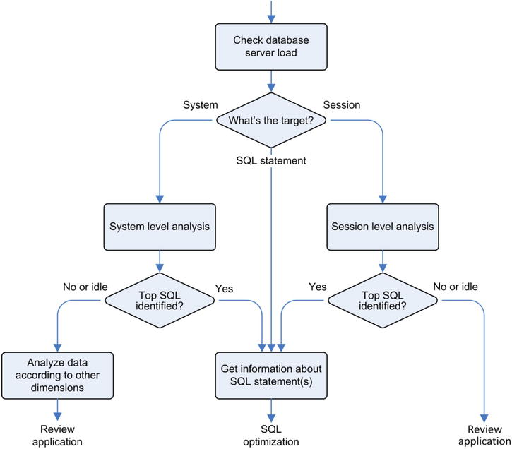

# Tools

## The way

If you know which use-cae peforms badly, focus on it

If not, check this



## Identify origin

Set
```oracle
BEGIN
  dbms_session.set_identifier(client_id=>'helicon.antognini.ch');
  dbms_application_info.set_client_info(client_info=>'Linux x86_64');
  dbms_application_info.set_module(module_name=>'session_info.sql',
                                   action_name=>'test session information');
END;
```

Get
```oracle
SELECT client_identifier,
       client_info,
       module AS module_name,
       action AS action_name
FROM v$session
WHERE sid = sys_context('userenv','sid');
```

## Dynamic Performance Views

> Some of them are continuously updated, and others are only updated every 5 seconds.

Type:
- not RAC: v$
- RAC: gv$
- 
### OS

```oracle
 SELECT stat_name, value, comments
  FROM v$osstat
  WHERE stat_name LIKE '%MEMORY_BYTES';
```


### time model 

[V$SESS_TIME_MODEL](https://docs.oracle.com/en/database/oracle/oracle-database/21/refrn/V-SESS_TIME_MODEL.html)

> You can know what **kind** of processing a database engine is doing on behalf of an application by looking at the time model statistics.

Check time spent on behalf of an application
- opening new sessions
- parsing SQL statements
- processing calls with one of the engines (SQL, PL/SQL)

> adding up the time reported by all children does NOT gives their parent's time
> - a specific operation is not exclusively associated to a single child
> - some operations aren’t attributed to any child.

#### All stats

For a session id
```oracle
SELECT 
    ssn.sid, 
    tm.stat_name,
    tm.value time_micros
FROM v$session ssn INNER JOIN v$sess_time_model tm
        ON tm.sid = ssn.sid
WHERE 1=1
    AND ssn.client_identifier = 'profiling'
--  AND ssn.sid = 42
--     AND stat_name = 'DB time'
ORDER BY 
--     tm.value DESC
    tm.stat_name ASC
```

For the whole system
```oracle
SELECT *
FROM v$sys_time_model
```

#### DB time

For a session id
```oracle
SELECT 
    ssn.sid, 
    tm.stat_name,
    tm.value time_micros
FROM v$session ssn INNER JOIN v$sess_time_model tm
        ON tm.sid = ssn.sid
WHERE 1=1
    AND ssn.client_identifier = 'profiling'
--  AND ssn.sid = 42
     AND stat_name = 'DB time'
ORDER BY 
    tm.value DESC
```

#### Background time

For a session id
```oracle
SELECT 
    ssn.sid, 
    tm.stat_name,
    tm.value time_micros
FROM v$session ssn INNER JOIN v$sess_time_model tm
        ON tm.sid = ssn.sid
WHERE 1=1
    AND ssn.client_identifier = 'profiling'
--  AND ssn.sid = 42
     AND stat_name = 'background elapsed time'
ORDER BY 
    tm.value DESC
```

#### On each leaf

> the time spent by the database engine waiting on user calls isn’t included
> to know exactly what’s going on, information about wait classes and wait events is necessary.
```oracle
WITH
  db_time AS (SELECT sid, value
              FROM v$sess_time_model
              WHERE sid = 22 -- <= SID HERE
              AND stat_name = 'DB time')
SELECT ses.stat_name AS statistic,
       round(ses.value / 1E6, 3) AS seconds,
       round(ses.value / nullif(tot.value, 0) * 1E2, 1) AS "%"
FROM v$sess_time_model ses, db_time tot
WHERE 1=1
    AND ses.sid = tot.sid
    AND ses.stat_name <> 'DB time'
    AND ses.value > 0
ORDER BY ses.value DESC;
```

>  Because DB time accounts only for the database processing time, the time spent by the database engine waiting on user calls isn’t included. As a result, with only the information provided by the time model statistics, you can’t know whether the problem is located inside or outside the database.

Ih the problem is located outside, in the application itself, the application may spend say less than 2% of its time waiting for the database. If so, reducing this time to 1% will not reduce overall performance more than 1%.

> The values are the ones that were set at hard parse time in the session that first parsed the SQL statement ! (TOP)

Get executed long queries 

#### average number of active sessions

> DN time is the overall elapsed time spent by the database engine processing user calls (not time spent waiting on user calls).

> The average number of active sessions (AAS) is the rate at which the DB time increases at the system level.

Because DB time is the time elapsed, cumulated by CPU, in one minute on a 10 CPU instance, DB time can reach 600 (60*10).

> For example, if the DB time of a database instance increases by 1,860 seconds in 60 seconds, the average number of active sessions is 31 (1,860/60). This means that, during the 60-second period, on average 31 sessions were actively processing user calls.

If going from no activity to maximum activity (saturation) in 60 seconds
AAS = increase DB time / period = 600 / 60 = 10 = CPU count.

> As a rule of thumb, values much lower than the number of CPU cores mean that the system is almost idle. Inversely, values much higher than the number of CPU cores mean that the system is quite busy.

How can value go higher than the number of CPU cores ?

[But](https://support.quest.com/kb/4228410/what-are-average-active-sessions-in-a-database-agent-workload) it does not refer to session in v$sessions
>  It is not a measure of how many sessions exist in the system at a given time, but rather how busy the database is.

#### wait

> you can determine 
> - how much processing time a database instance is consuming
> - how much CPU it’s using for that processing. 
>
> When the two values are equivalent, it means that the database instance isn’t experiencing any wait. If  the difference between the two values is significant, you need to know which waits the server processes are waiting for.

wait 
- disk I/O operations
- network round-trips
- locks

>  1,500 wait events into 13 wait classes

Classes
```oracle
SELECT wait_class, COUNT(*)
FROM v$event_name
GROUP BY wait_class
ORDER BY wait_class;
```

Event
```oracle
SELECT 
    'event='
    ,vnt.event_id
    ,vnt.name
    ,'v$event_name=>'
    ,vnt.*
FROM v$event_name vnt
WHERE 1=1
--     AND vnt.wait_class = 'Concurrency'
    AND vnt.wait_class = 'Configuration'
--     AND vnt.wait_class_id = '3290255840'
--     AND vnt.name = 'library cache lock'
--     AND vnt.name = 'library cache lock'
ORDER BY vnt.wait_class, vnt.name
```

##### session

Get wait time (value) for session
```oracle
SELECT *
FROM v$session_wait_class ssn_wt
WHERE 1=1
    AND ssn_wt.sid = 207
ORDER BY time_waited_micro DESC;

-- Check data
SELECT *
FROM v$sess_time_model
WHERE 1=1
    AND sid = 207
ORDER BY value DESC
```

Get wait time (distribution) for session
```oracle
SELECT wait_class,
       round(time_waited, 3) AS time_waited,
       round(1E2 * ratio_to_report(time_waited) OVER (), 1) AS "%"
FROM (
  SELECT sid, wait_class, time_waited / 1E2 AS time_waited
  FROM v$session_wait_class
  WHERE total_waits > 0
  UNION ALL
  SELECT sid, 'CPU', value / 1E6
  FROM v$sess_time_model
  WHERE stat_name = 'DB CPU'
)
WHERE sid = 207
ORDER BY 2 DESC;
```


##### system

Top wait event
```oracle
select * from (
	select
		 WAIT_CLASS ,
		 EVENT,
		 count(sample_time) as EST_SECS_IN_WAIT
	from v$active_session_history
	where sample_time between sysdate - interval '1' hour and sysdate
	group by WAIT_CLASS,EVENT
	order by count(sample_time) desc
	)
where rownum <6
```

All waited on wait events
```oracle
SELECT event,
       round(time_waited, 3) AS time_waited,
       round(1E2 * ratio_to_report(time_waited) OVER (), 1) AS "%"
FROM (
  SELECT event, time_waited_micro / 1E6 AS time_waited
  FROM v$system_event
  WHERE total_waits > 0
  UNION ALL
  SELECT  'CPU', value / 1E6
  FROM v$sys_time_model
  WHERE stat_name = 'DB CPU'
)
ORDER BY 2 DESC;
```

If most of the time is elapsed on idle wait event (SQL*Net message from client), tThis indicates that the database engine is waiting for the application to submit some work.

> The other essential information provided by this resource usage profile may be that, when the database engine is processing user calls, it’s almost always doing disk I/O operations that read a single block (db file sequential read).

I/O : Average waiting time on I/O
```oracle
SELECT time_waited_micro/total_waits/1E3 AS avg_wait_ms
FROM v$system_event
WHERE event = 'db file sequential read';
```

I/O : Histogram waiting time
```oracle
SELECT wait_time_milli, wait_count, 100*ratio_to_report(wait_count) OVER () AS "%"
FROM v$event_histogram
WHERE event = 'db file sequential read'; 
```

Histogram (buckets)
```oracle
SELECT event, SUM(WAIT_TIME_MILLI * WAIT_COUNT)
FROM v$event_histogram
GROUP BY event
ORDER BY SUM(WAIT_TIME_MILLI * WAIT_COUNT) DESC
```

Histogram (buckets)
For event
```oracle
SELECT t.event, t.wait_time_milli, t.WAIT_COUNT
--      ,t.*
FROM v$event_histogram t
WHERE event = 'log file switch completion' 
-- GROUP BY t.wait_time_milli
ORDER BY t.event ASC, t.wait_time_milli ASC
```

Histogram (buckets)
Max count
```oracle
SELECT t.event, t.wait_time_milli, t.wait_count
--      ,t.*
FROM v$event_histogram t
-- WHERE event = 'log file switch completion' 
-- GROUP BY t.wait_time_milli
ORDER BY t.wait_count DESC
```

Histogram (buckets)
Max wait_time
```oracle
SELECT t.event, t.wait_time_milli, t.wait_count
--      ,t.*
FROM v$event_histogram t
-- WHERE event = 'log file switch completion' 
-- GROUP BY t.wait_time_milli
ORDER BY t.wait_time_milli DESC
```

### cumulated additional statistics (v$sysstat / v$sessstat)

> In most situations, an analysis starts by breaking up the response time into 
> - CPU consumption
> - wait events
> 
> If a session is always on CPU and, therefore, doesn’t experience any wait event
> => session statistics might be very useful to understand what the session is doing.

All
```oracle
SELECT name, value
FROM v$sysstat
WHERE 1=1
--     AND name IN ('logons cumulative', 'user commits', 'sorts (memory)');
    AND value <> 0
ORDER BY name
```

Cumulated I/O
```oracle
SELECT name, value
FROM v$sysstat
WHERE 1=1
  AND name LIKE 'physical % total bytes';
ORDER BY name
```

Session, PGA
```oracle
SELECT sn.name, ss.value
FROM v$statname sn, v$sesstat ss
WHERE 1=1
    AND sn.statistic# = ss.statistic#
    AND sn.name LIKE 'session pga memory%'
    AND ss.sid = sys_context('userenv','sid');
```

### Metrics (selection of statistics)

Metrics
```oracle
SELECT metric_id, metric_unit, group_id, group_name
FROM v$metricname
WHERE 1=1
--     AND metric_name = 'Host CPU Usage Per Sec';
```
Groups
```oracle
SELECT 
    group_id,
    name,
    interval_size frequency,
    max_interval  how_much_values
FROM v$metricgroup
WHERE 1=1
    AND  name = 'System Metrics Long Duration'
ORDER BY group_id;
```
Computed every 60 seconds, with 60 values, so one hour history.

Values
```oracle
SELECT metric_name, begin_time, end_time, value, metric_unit
FROM v$metric
WHERE metric_name LIKE '%CPU%'
ORDER BY metric_name
```


### Session status (v$session)

Overview 
>
    The identification of the session (sid, serial#, saddr and audsid), whether it’s a BACKGROUND or USER session (type), and when it was initialized (logon_time).
    The identification of the user that opened the session (username and user#), the current schema (schemaname), and the name of the service used to connect to the database engine (service_name).
    The application using the session (program), which machine it was started on (machine), which process ID it has (process), and the name of the OS user who started it (osuser).
    The type of server-side process (server) which can be either DEDICATED, SHARED, PSEUDO, POOLED or NONE, and its address (paddr).
    The address of the currently active transaction (taddr).
    The status of the session (status) which can be either ACTIVE, INACTIVE, KILLED, SNIPED, or CACHED and how many seconds it’s been in that state for (last_call_et). When investigating a performance problem, you’re usually interested in the sessions marked as ACTIVE only.
    The type of the SQL statement in execution (command), the identification of the cursor related to it (sql_address, sql_hash_value, sql_id and sql_child_number), when the execution was started (sql_exec_start), and its execution ID (sql_exec_id). The execution ID is an integer value that identifies, along with sql_exec_start, one specific execution. It’s necessary because the same cursor can be executed several times per second (note that the datatype of the sql_exec_start column is DATE).
    The identification of the previous cursor that was executed (prev_sql_address, prev_hash_value, prev_sql_id and prev_child_number), when the previous execution was started (prev_exec_start), and its execution ID (prev_exec_id).
    If a PL/SQL call is in execution, the identification of the top-level program and subprogram (plsql_entry_object_id and plsql_entry_subprogram_id) that was called, and the program and subprogram (plsql_object_id and plsql_subprogram_id) that is currently in execution. Note that plsql_object_id and plsql_subprogram_id are set to NULL if the session is executing a SQL statement.
    The session attributes (client_identifier, module, action, and client_info), if the application using the session sets them.
    If the session is currently waiting (in which case the state column is set to WAITING), the name of the wait event it’s waiting for (event), its wait class (wait_class and wait_class#), details about the wait event (p1text, p1, p1raw, p2text, p2, p2raw, p3text, p3, and p3raw), and how much time the session has been waiting for that wait event (seconds_in_wait and, from 11.1 onward, wait_time_micro). Be aware that if the state column isn’t equal to WAITING, the session is on CPU (provided the status column is equal to ACTIVE). In this case, the columns related to the wait event contain information about the last wait.
    Whether the session is blocked by another session (if this is the case, blocking_session_status is set to VALID) and, if the session is waiting, which session is blocking it (blocking_instance and blocking_session).
    If the session is currently blocked and waiting for a specific row (for example, for a row lock), the identification of the row it’s waiting for (row_wait_obj#, row_wait_file#, row_wait_block#, and row_wait_row#). If the session isn’t waiting for a locked row, the row_wait_obj# column is equal to the value -1.

Other related view:
- v$session_wait : wait events
- v$session_blockers : blocked sessions.

### Session history (ASH)

One-hour history.

Carried by `MMNL` background process:
- poll `v$session` each second
- filter out inactive session
- store 'events' (if activity has changed, eg. CPU or User I/O) and `sqlId`

Size
```oracle
SELECT name, pool, bytes
FROM v$sgastat
WHERE name = 'ASH buffers';
```

Retention
```oracle
SELECT max(sample_time) - min(sample_time) AS interval
FROM v$active_session_history;
```

History
```oracle
SELECT
    sample_time
    ,session_id
    ,session_serial#
    ,session_state
    ,sql_id
    ,in_sql_execution SQL
    ,in_plsql_execution PLSQL
    ,sql_plan_operation || ' ' || sql_plan_options
    ,'v$active_session_history=>'
    --,ssn_hst.*
FROM v$active_session_history ssn_hst
WHERE 1=1
    AND session_id = 205
ORDER BY ssn_hst.sample_time ASC;
```

Top 10 (-1h)
```oracle
SELECT activity_pct,
       db_time,
       sql_id
FROM (
  SELECT round(100 * ratio_to_report(count(*)) OVER (), 1) AS activity_pct,
         count(*) AS db_time,
         sql_id
  FROM v$active_session_history
  WHERE sample_time BETWEEN to_timestamp('2025-01-10 00:00:00', 'YYYY-MM-DD HH24:MI:SS')
                        AND to_timestamp('2025-01-10 23:59:59', 'YYYY-MM-DD HH24:MI:SS')
  AND sql_id IS NOT NULL
  GROUP BY sql_id
  ORDER BY count(*) DESC
)
WHERE rownum <= 10;
```

Associated SQL
```oracle
SELECT *
FROM v$sql
WHERE 1=1
    AND sql_id = 'd3d7q56sqr8wf'
```

### SQL Statement Statistics

Parent
```oracle
SELECT 
     'SQL parent:'  
    ,prn.sql_id
    ,prn.sql_text
    ,prn.executions
    ,prn.parse_calls
    ,prn.rows_processed
    ,prn.is_bind_aware
    ,'v$sqlarea=>'
    ,prn.*
FROM v$sqlarea prn
WHERE 1=1
    AND prn.module LIKE 'sqlplus%'
--     AND prn.sql_text LIKE '%SELECT%'
ORDER BY prn.elapsed_time DESC
```

Child
```oracle
SELECT
     'SQL child:'  
    ,chl.sql_id
    ,chl.sql_text
    ,chl.executions
    ,chl.parse_calls
    ,chl.rows_processed
    ,chl.is_bind_aware
    ,'v$sql=>'
    ,chl.*
FROM v$sql chl
WHERE 1=1
    AND chl.module LIKE 'sqlplus%'
    AND chl.sql_text LIKE '%SELECT%'
ORDER BY chl.elapsed_time DESC
```

Stats
```oracle
SELECT
    'SQL stats:'
     ,sql_stt.sql_id
     ,sql_stt.sql_text
     ,sql_stt.last_active_time
     ,sql_stt.executions
     ,sql_stt.parse_calls
     ,sql_stt.rows_processed
     ,sql_stt.cpu_time
     ,sql_stt.elapsed_time
     ,sql_stt.plsql_exec_time
     ,'v$sql=>'
     ,sql_stt.*
FROM v$sqlstats sql_stt
WHERE 1=1
  AND sql_stt.sql_id = 'd3d7q56sqr8wf'
--   AND sql_stt.sql_text LIKE '%simple%'
ORDER BY sql_stt.elapsed_time DESC
```

### Real-time Monitoring

> Real-time monitoring provides historical information about the execution of cursors.

> Because it makes no sense to monitor all executions, by default the database engine enables monitoring in three specific cases only:
>    - For executions that consume at least 5 seconds of combined CPU and disk I/O time
>    - For executions that use parallel processing
>    - For SQL statements that explicitly enable real-time monitoring by specifying the monitor hint

> In two situations, the database engine can silently disable real-time monitoring for specific executions:
> - when an execution plan exceeds 300 lines
> - when more than 20 concurrent executions per CPU are monitored
>
> To overcome these limitations, you can increase the default value of the _sqlmon_max_planlines and _sqlmon_max_plan undocumented initialization parameters, respectively

> To get all information gathered by real-time monitoring, you need to generate a report through the report_sql_monitor function of the dbms_sqltune package.

Start
```oracle
SELECT dbms_sqltune.report_sql_monitor(sql_id => '5kwfj03dc3dp1',
                                       type   => 'active')
FROM dual
```

#### Database Server Load

Server load
```oracle
SELECT *
FROM  v$metric_history
```

> When looking at the database server load, you should check not only whether the database server is CPU bound (in other words, if all CPU cores are fully used), but also whether there are processes not related to the database instance you’re focusing on that consume a lot of CPU time.

Script `host_load_hist.sql`

Eg. something happened at `17:35` (not much)
```text
BEGIN_TIME DURATION DB_FG_CPU DB_BG_CPU NON_DB_CPU OS_LOAD NUM_CPU
---------- -------- --------- --------- ---------- ------- -------
17:31:43      60.04	 0.00	   0.00       0.00    0.00	 4
17:32:43      60.05	 0.00	   0.00      -0.00    0.00	 4
17:33:43      60.04	 0.00	   0.00      -0.00    0.00	 4
17:34:43      60.04	 0.24	   0.00      -0.24    0.00	 4
17:35:43      60.02	 1.17	   0.00      -1.17    0.00	 4
17:36:43      60.04	 0.32	   0.00      -0.32    0.00	 4
17:37:43      60.04	 0.00	   0.00       0.00    0.00	 4
```

#### System Level Analysis

##### Find the time when activity occurred

> The aim of the activity chart is twofold. First, it allows you to have an idea of what’s going on from a database engine point of view.
> For example, you can not only infer that the average number of active sessions goes between 3 and 13 (hence, because the number of CPUs is 8, the database engine is moderately loaded), but also that most of the DB time is spent in the User I/O class.
> Second, you use it to select the 5-minute interval for which you want to display more details about the database load. Hence, if you aren’t analyzing something that happened at a specific moment, you usually select the period with the highest number of active sessions. In other words, you select the period with the highest load.

Use `ash_activity.sql` to display AAC and wait events
```text

```
##### Then find out what happened at this time, which SQL


> Once you’ve selected the 5-minute interval you want to focus on, it’s time to take a look at the detailed information provided by the Top SQL table.

Use `ash_top_sqls.sql` to get 10 more active SQL

```text
Period Begin		       Period End		      Total Sample Count
------------------------------ ------------------------------ ------------------
2025-01-09_00:00:00.000000000  2025-01-09_23:00:00.000000000		   1,497

Activity%    DB Time   CPU% UsrIO%  Wait% SQL Id	SQL Type
--------- ---------- ------ ------ ------ ------------- ----------------------------
     78.8      1,179  100.0    0.0    0.0 d3d7q56sqr8wf SELECT
     13.8	 206   65.5    1.5   33.0 dc7kbzstu82bt INSERT
      2.1	  31  100.0    0.0    0.0 cbu16wv87m9vw PL/SQL EXECUTE
      1.7	  26  100.0    0.0    0.0 830jfhnhksm4j SELECT
      0.7	  11  100.0    0.0    0.0 2pkpuk0vd342z INSERT
      0.3	   4  100.0    0.0    0.0 15h962pgnm0x0 PL/SQL EXECUTE
      0.1	   2  100.0    0.0    0.0 586577qpbkgnk SELECT
      0.1	   2  100.0    0.0    0.0 gzmz63qmyshp5 SELECT
      0.1	   1  100.0    0.0    0.0 f3ww8rgva3hrs UPDATE
      0.1	   1  100.0    0.0    0.0 1mxdnsvtchmn4 INSERT
```

> If it indicates that few SQL statements are responsible for a large part of the activity (for example, the activity of a single SQL statement is a double-digit percentage), you’ve identified the SQL statements that you have to further analyze. For example, seven queries are, in total, responsible for more than 90% of the activity. So, to reduce the load on the system, you have to focus on them.

> If no particular SQL statement stands out, it obviously means that the activity is produced by many SQL statements. Hence, it’s a sign that major changes in the applications might be necessary to improve performance

> To display the data aggregated according to a specific dimension, use one of the following scripts: 
> - ash_top_sessions.sql
> - ash_top_services.sql
> - ash_top_modules.sql
> - ash_top_actions.sql
> - ash_top_clients.sql
> - ash_top_files.sql
> - ash_top_objects.sql
> - and ash_top_plsql.sql

#### session Level Analysis

Use `ash_top_sqls.sql` script

Use script with session id
```oraclesqlplus
 @ash_activity.sql 232 all
```

#### SQL Statement Information

> You can use one of the following scripts: 
> - sqlarea.sql
> - sql.sql
> - sqlstats.sql

To display activity, pass sqlId
```oraclesqlplus
@ash_activity.sql all c13sma6rkr27c
```

#### no session stands out  

##### snapper

> If, according to the output of the script, few sessions are responsible for a large part of the activity (for example, the activity of a single session is at least a double-digit percentage), you have identified sessions that you might want to further analyze. 
> If, as in the example above, no particular session stands out, it obviously means that the activity is due to many sessions.

Use [snapper](https://github.com/tanelpoder/tpt-oracle/blob/master/snapper.sql)

> Its key functionality is to sample the v$session view at a frequency that is inversely proportional to the sampling period. During the sampling, Snapper checks the status of the specified sessions and, for active sessions, it gathers information about their activity (for example, which SQL statement is in execution).

Launch activity:
- many small queries => `6km8p5f8573mr`
- one big query => `d3d7q56sqr8wf`
```shell
watch -n 1 just query-table
just query-table-many-times
```

With `snapper.sql ash=sql_id 15 1 all`

```text
 ActSes   %Thread | SQL_ID
------------------------------------
    1.00    (100%) | d3d7q56sqr8wf
     .20     (20%) | 9xz7yas8z9pd9
     .05      (5%) |
     .01      (1%) | 6km8p5f8573mr
     .01      (1%) | f3ww8rgva3hrs
     .01      (1%) | 7qb74y7hp6cwd
     .01      (1%) | 4rg3vr6z5yw7m
```


##### Statistics of the last 15 seconds

Not available in v$session, they are cumulated

```shell
just sqlplus-administrator-bash
```

Then
```oraclesqlplus
@/tmp/scripts/sqlstats.sql d3d7q56sqr8wf 15
```

You'll get
```text
-----------------------------------------------------------------------------------------
Interval (seconds)									15
Period						 2025-01-09 18:11:19 - 2025-01-09 18:11:34
------------------------------------------------------------------------------------------
Identification
------------------------------------------------------------------------------------------
Container Id										 3
SQL Id									     d3d7q56sqr8wf
Execution Plan Hash Value							1067509040
------------------------------------------------------------------------------------------
Shared Cursors Statistics
------------------------------------------------------------------------------------------
Total Parses										 0
Loads / Hard Parses									 0
Invalidations										 0
Cursor Size / Shared (bytes)								 0
------------------------------------------------------------------------------------------
Activity by Time
------------------------------------------------------------------------------------------
Elapsed Time (seconds)								    15.126
CPU Time (seconds)								    15.119
Wait Time (seconds)								     0.007
------------------------------------------------------------------------------------------
Activity by Waits
------------------------------------------------------------------------------------------
Application Waits (%)								     0.000
Concurrency Waits (%)								     0.000
Cluster Waits (%)								     0.000
User I/O Waits (%)								     0.000
Remaining Waits (%)								     0.049
CPU (%) 									    99.951
------------------------------------------------------------------------------------------
Elapsed Time Breakdown
------------------------------------------------------------------------------------------
SQL Time (seconds)								    15.126
PL/SQL Time (seconds)								     0.000
Java Time (seconds)								     0.000
------------------------------------------------------------------------------------------
Execution Statistics				 Total	   Per Execution	   Per Row
------------------------------------------------------------------------------------------
Elapsed Time (milliseconds)			15,126		     233	   232.712
CPU Time (milliseconds) 			15,119		     233	   232.597
Executions					    65		       1	     1.000
Buffer Gets				       987,572		  15,193	15,193.415
Disk Reads					     0		       0	     0.000
Direct Writes					     0		       0	     0.000
Rows						    65		       1	     1.000
Fetches 					    65		       1	     1.000
Average Fetch Size				     1
------------------------------------------------------------------------------------------
Other Statistics
------------------------------------------------------------------------------------------
Executions that Fetched All Rows (%)						       100
Serializable Aborts									 0
------------------------------------------------------------------------------------------
```


## Debug executed queries (profiler)

### SQL trace

Check timings are available
```oracle
SHOW PARAMETER timed_statistics
ALTER SESSION SET timed_statistics = TRUE
```

If you need to restrict trace file, you can, otherwise:
```oracle
ALTER SESSION SET max_dump_file_size = 'unlimited'
```

#### Capture

##### session level

###### from session itself

Use `ALTER SESSION SET`

Activate (basic)
```oracle
ALTER SESSION SET sql_trace = TRUE
```

Activate (better)
```oracle
ALTER SESSION SET events '10046 trace name context forever, level 12'
```

Disable
```oracle
ALTER SESSION SET events '10046 trace name context off'
```

Or use `dbms_session`

```oracle
BEGIN
  dbms_session.session_trace_enable(waits     => TRUE,
                                    binds     => TRUE,
                                    plan_stat => 'all_executions');
END;
/
```

Or `EXEC` syntax instead of a PL/SQL block
```oracle
    EXEC DBMS_SESSION.SESSION_TRACE_ENABLE();
```

Check
```oracle
SELECT sql_trace, sql_trace_waits, sql_trace_binds, sql_trace_plan_stats
FROM v$session
WHERE sid = sys_context('userenv','sid');
``` 

You'll get
```
SQL_TRACE SQL_TRACE_WAITS SQL_TRACE_BINDS SQL_TRACE_PLAN_STATS
--------- --------------- --------------- --------------------
ENABLED   TRUE            TRUE            ALL EXEC
```

Stop
```oracle
BEGIN
  dbms_session.session_trace_disable;
END;
/
```

###### from another session

Get session id
```oracle
SELECT 'session id is : ' || sys_context('userenv','sessionid')
FROM dual;
```

Or
```oracle
SELECT 
    sss.logon_time
   ,sss.username       --tls_dtf
   ,sss.osuser
   ,sss.program
   ,sss.client_info
  ,sss.*
FROM 
   v$session   sss
WHERE 1=1
  -- AND sss.sid IN (1165,1152,23)
   AND sss.username   =  'DBOFAP'
   AND sss.osuser     =  'fap'
  -- AND sss.status     =   'ACTIVE'
   AND sss.program    LIKE    'sqlplus%'
ORDER BY
   sss.client_info
;
```

Activate
```oracle
dbms_monitor.session_trace_enable(session_id => 127,
                                  serial_num => 29,
                                  waits      => TRUE,
                                  binds      => FALSE,
                                  plan_stat  => 'first_execution')
```

Check if active on this session
```oracle
SELECT sql_trace, sql_trace_waits, sql_trace_binds, sql_trace_plan_stats
FROM v$session
WHERE sid = 127;
```

Disable
```oracle
dbms_monitor.session_trace_disable(session_id => 127,
serial_num => 29)
```

##### client level

Set client identifier
```oracle
CALL dbms_session.set_identifier('client_identifier');
```

Activate
```oracle
dbms_monitor.client_id_trace_enable(client_id => 'client_identifier',
                                    waits     => TRUE,
                                    binds     => TRUE,
                                    plan_stat => 'first_execution')
```

Deactivate
```oracle
dbms_monitor.client_id_trace_disable(client_id => 'client_identifier')
```

##### component level (module, action)

Get service name
```oracle
SELECT * FROM global_name;
```
You may get `FREEPDB1`

Activate
```oracle
dbms_monitor.serv_mod_act_trace_enable(service_name  => 'FREEPDB1',
                                       module_name   => 'mymodule',
                                       action_name   => 'myaction',
                                       waits         => TRUE,
                                       binds         => TRUE,
                                       instance_name => NULL,
                                       plan_stat     => 'all_executions')
```

Deactivate
```oracle
dbms_monitor.serv_mod_act_trace_disable(service_name  => 'FREEPDB1',
                                        module_name   => 'mymodule',
                                        action_name   => 'myaction',
                                        instance_name => NULL)
```


##### database level

Get instance name
```oracle
SELECT instance_name 
FROM gv$instance
```

You mey get `FREE`

Activate
```oracle
dbms_monitor.database_trace_enable(waits         => TRUE,
                                   binds         => TRUE,
                                   instance_name => 'instance_name',
                                   plan_stat     => 'first_execution')
```

Deactivate
```oracle
dbms_monitor.database_trace_disable(instance_name => 'instance_name')
```

##### Sample output
```text
PARSING IN CURSOR #140105537106328 len=139 dep=1 uid=77 oct=3 lid=93 tim=1344867866442114 hv=2959931450 ad='706df490' sqlid='arc3zqqs6ty1u'
SELECT CUST_ID, EXTRACT(YEAR FROM TIME_ID), SUM(AMOUNT_SOLD) FROM SALES WHERE CHANNEL_ID = :B1 GROUP BY CUST_ID, EXTRACT(YEAR FROM TIME_ID)
END OF STMT
PARSE #140105537106328:c=1999,e=1397,p=0,cr=0,cu=0,mis=1,r=0,dep=1,og=1,plh=0, tim=1344867866442113
BINDS #140105537106328:
 Bind#0
  oacdty=02 mxl=22(21) mxlc=00 mal=00 scl=00 pre=00
  oacflg=03 fl2=1206001 frm=00 csi=00 siz=24 off=0
  kxsbbbfp=7f6cdcc6c6e0  bln=22  avl=02  flg=05
  value=3
EXEC #140105537106328:c=7000,e=7226,p=0,cr=0,cu=0,mis=1,r=0,dep=1,og=1,plh=3604305554, tim=1344867866449493
WAIT #140105537106328: nam='Disk file operations I/O' ela= 45 FileOperation=2 fileno=4 filetype=2 obj#=69232 tim=1344867866450319
WAIT #140105537106328: nam='db file sequential read' ela= 59 file#=4 block#=5009 blocks=1 obj#=69232 tim=1344867866450423
...
...
FETCH #140105537106328:c=0,e=116,p=0,cr=0,cu=0,mis=0,r=48,dep=1,og=1,plh=3604305554, tim=1344867867730523
STAT #140105537106328 id=1 cnt=16348 pid=0 pos=1 obj=0 op='HASH GROUP BY (cr=1781 pr=3472 pw=1699 time=1206229 us cost=9220 size=4823931 card=229711)'
STAT #140105537106328 id=2 cnt=540328 pid=1 pos=1 obj=0 op='PARTITION RANGE ALL PARTITION: 1 28 (cr=1781 pr=1773 pw=0 time=340163 us cost=1414 size=4823931 card=229711)'
STAT #140105537106328 id=3 cnt=540328 pid=2 pos=1 obj=69227 op='TABLE ACCESS FULL SALES PARTITION: 1 28 (cr=1781 pr=1773 pw=0 time=280407 us cost=1414 size=4823931 card=229711)'
CLOSE #140105537106328:c=0,e=1,dep=1,type=3,tim=1344867867730655
...
```

#### Activate automatically

Without changing code, using a role
```oracle
CREATE ROLE sql_trace;
 
CREATE OR REPLACE TRIGGER enable_sql_trace AFTER LOGON ON DATABASE
BEGIN
  IF (dbms_session.is_role_enabled('SQL_TRACE'))
  THEN
    EXECUTE IMMEDIATE 'ALTER SESSION SET timed_statistics = TRUE';
    EXECUTE IMMEDIATE 'ALTER SESSION SET max_dump_file_size = unlimited';
    dbms_session.session_trace_enable;
  END IF;
END;
```

#### Get files

Find directory
```oracle
SELECT value FROM v$parameter WHERE name = 'diagnostic_dest';
 
VALUE
---------------
/u00/app/oracle
 
SELECT value FROM v$diag_info WHERE name = 'Diag Trace';
 
VALUE
--------------------------------------------------
/u00/app/oracle/diag/rdbms/dbm11203/DBM11203/trace
```

File path is then 
```oracle
SELECT value
FROM v$diag_info
WHERE name = 'Default Trace File';
 
VALUE
--------------------------------------------------------------------
/u00/app/oracle/diag/rdbms/dba111/DBA111/trace/DBA111_ora_23731.trc
 
SELECT p.tracefile
FROM v$process p, v$session s
WHERE p.addr = s.paddr
AND s.sid = sys_context('userenv','sid');
 
TRACEFILE
--------------------------------------------------------------------
/u00/app/oracle/diag/rdbms/dba111/DBA111/trace/DBA111_ora_23731.trc
```

Filename is `{instance name}_{process name}_{process id}.trc`

PID
```oracle
SELECT spid FROM v$process;
```

Add an identifier to trace file name (suffix)
```oracle
ALTER SESSION SET tracefile_identifier = 'mytrace'
{instance name}_{process name}_{process id}_{tracefile identifier}.trc
```

#### Analyze


### Filter an action : TRCSESS

Will produce another trace file, only with action
```shell
trcsess output=$ACTION.trc action="$ACTION" DBM11203_ora_7978.trc
```

### Profile, actually

#### TKPROF (Transient Kernel Profiler

Run
```shell
tkprof $TRACE.trc $REPORT.txt
```

Run (better) - no explain
```shell
tkprof $TRACE.trc $REPORT.txt sys=no sort=prsela,exeela,fchela
```


Sample output
```text
SELECT CUST_ID, EXTRACT(YEAR FROM TIME_ID), SUM(AMOUNT_SOLD)
FROM SALES
WHERE CHANNEL_ID = :B1
GROUP BY CUST_ID, EXTRACT(YEAR FROM TIME_ID)
 
call     count       cpu    elapsed       disk      query    current        rows
------- ------  -------- ---------- ---------- ---------- ----------  ----------
Parse        1      0.00       0.00          0          0          0           0
Execute      1      0.00       0.00          0          0          0           0
Fetch      164      0.84       1.27       3472       1781          0       16348
------- ------  -------- ---------- ---------- ---------- ----------  ----------
total      166      0.84       1.28       3472       1781          0       16348
 
Misses in library cache during parse: 1
Misses in library cache during execute: 1
Optimizer mode: ALL_ROWS
Parsing user id: 77  (SH)   (recursive depth: 1)
Number of plan statistics captured: 1
 
Rows (1st) Rows (avg) Rows (max)  Row Source Operation
---------- ---------- ----------  ------------------------------------------
     16348      16348      16348  HASH GROUP BY
    540328     540328     540328   PARTITION RANGE ALL PARTITION: 1 28
    540328     540328     540328    TABLE ACCESS FULL SALES PARTITION: 1 28
 
Elapsed times include waiting on following events:
  Event waited on                      Times Waited   Max. Wait  Total Waited
  -----------------------------------  ------------  ----------  ------------
  Disk file operations I/O                        2        0.00          0.00
  db file sequential read                        29        0.00          0.00
  direct path read                               70        0.00          0.00
  asynch descriptor resize                       16        0.00          0.00
  direct path write temp                       1699        0.02          0.62
  direct path read temp                        1699        0.00          0.00
```

#### TVD$XTAT

[Source](https://antognini.ch/category/apmtools/tvdxtat/)

Install

> To fix those problems (TOP):

>  -  As soon as the sort argument is specified, the relationship between SQL statements is lost.
>  -  Data is provided only in aggregated form. Consequently, useful information is lost.
>  -  No information about bind variables is provided.
>  -  Idle wait events (for example, SQL*Net message from client) taking place during the execution of a SQL statement aren’t accounted for in the elapsed time shown by TKPROF. As a result, when SQL statements are sorted according to their elapsed time, the output might be misleading or, in extreme cases, very time consuming if not nearly impossible to interpret.
>  -  When a trace file doesn’t contain the text of a SQL statement (specifically, the text delimited between the PARSING IN CURSOR and END OF STMT keywords), TKPROF doesn’t report the details about the SQL statement; it just accounts for the resource utilization in the summary at the end of the output file. Note that one case in which the text of a SQL statement isn’t stored in the trace file is when SQL trace is activated after the execution has already been started.

```shell
tvdxtat -i $TRACE.trc -o $REPORT.txt –s no –w yes -t text
```

#### Method-R


Instrumentation VS profiling

## Debug executed code (PL/SQL profiler)

### dbms_profiler (line-level)
Prefer dbms_hprof, unless you need to debug each line of your procedure


#### Create table

```oracle
CONNECT / AS SYSDBA
@?/rdbms/admin/proftab.sql
 
CREATE PUBLIC SYNONYM plsql_profiler_runs FOR plsql_profiler_runs;
CREATE PUBLIC SYNONYM plsql_profiler_units FOR plsql_profiler_units;
CREATE PUBLIC SYNONYM plsql_profiler_data FOR plsql_profiler_data;
CREATE PUBLIC SYNONYM plsql_profiler_runnumber FOR plsql_profiler_runnumber;
 
GRANT SELECT, INSERT, UPDATE, DELETE ON plsql_profiler_runs TO PUBLIC;
GRANT SELECT, INSERT, UPDATE, DELETE ON plsql_profiler_units TO PUBLIC;
GRANT SELECT, INSERT, UPDATE, DELETE ON plsql_profiler_data TO PUBLIC;
GRANT SELECT ON plsql_profiler_runnumber TO PUBLIC;
```

Start profiling
```oracle
dbms_profiler.start_profiler
dbms_profiler.stop_profiler routine
dbms_profiler.pause_profiler
dbms_profiler.resume_profiler
```

Get results
```oracle
SELECT s.line,
       round(ratio_to_report(p.total_time) OVER ()*100,1) AS time,
       total_occur,
       s.text
FROM all_source s,
     (SELECT u.unit_owner, u.unit_name, u.unit_type,
             d.line#, d.total_time, d.total_occur
      FROM plsql_profiler_units u, plsql_profiler_data d
      WHERE u.runid = 1
      AND d.runid = u.runid
      AND d.unit_number = u.unit_number) p
WHERE s.owner = p.unit_owner (+)
AND s.name = p.unit_name (+)
AND s.type = p.unit_type (+)
AND s.line = p.line# (+)
AND s.owner = user
AND s.name = 'PERFECT_TRIANGLES'
AND s.type IN ('PROCEDURE', 'PACKAGE BODY', 'TYPE BODY')
ORDER BY s.line;
```
PL/SQL Developer

### dbms_hprof (call-level, hierarchical)

Hierarchical PROFiler

Small overhead
No privileges

#### Install

```oracle
CONNECT / AS SYSDBA
@?/rdbms/admin/dbmshptab.sql

CREATE PUBLIC SYNONYM dbmshp_runs FOR dbmshp_runs;
CREATE PUBLIC SYNONYM dbmshp_function_info FOR dbmshp_function_info;
CREATE PUBLIC SYNONYM dbmshp_parent_child_info FOR dbmshp_parent_child_info;
CREATE PUBLIC SYNONYM dbmshp_runnumber FOR dbmshp_runnumber;

GRANT SELECT, INSERT, UPDATE, DELETE ON dbmshp_runs TO PUBLIC;
GRANT SELECT, INSERT, UPDATE, DELETE ON dbmshp_function_info TO PUBLIC;
GRANT SELECT, INSERT, UPDATE, DELETE ON dbmshp_parent_child_info TO PUBLIC;
GRANT SELECT ON dbmshp_runnumber TO PUBLIC;
```

#### Activate on session level

Begin
```oracle
BEGIN
      dbms_hprof.start_profiling(location => 'PLSHPROF_DIR',
                                 filename => 'dbms_hprof.trc');
END;
/
```

End
```oracle
BEGIN
      dbms_hprof.stop_profiling();
END;
/
```

Or trigger on logon
```oracle
CREATE TRIGGER start_hprof_profiler AFTER LOGON ON DATABASE
BEGIN
  IF (dbms_session.is_role_enabled('HPROF_PROFILE'))
  THEN
    dbms_hprof.start_profiling(
      location => 'PLSHPROF_DIR',
      filename => 'dbms_hprof_'||sys_context('userenv','sessionid')||'.trc'
    );
  END IF;
END;
/
 
CREATE TRIGGER stop_hprof_profiler BEFORE LOGOFF ON DATABASE
BEGIN
  IF (dbms_session.is_role_enabled('HPROF_PROFILE'))
  THEN
    dbms_hprof.stop_profiling();
  END IF;
END;
/
```

#### Process

##### Command-line
```shell
plshprof -output dbms_hprof dbms_hprof.trc
```

##### tables
Load
```oracle
SELECT dbms_hprof.analyze(location => 'PLSHPROF_DIR',
                          filename => 'dbms_hprof.trc') AS runid
FROM dual;
```

Query
```oracle
SELECT * FROM dbmshp_runs;
SELECT * FROM dbmshp_function_info;
SELECT * FROM dbmshp_parent_child_info;
```

Level 1: SQL or PL/SQL ?
```oracle
SELECT sum(function_elapsed_time)/1000 AS total_ms,
       100*ratio_to_report(sum(function_elapsed_time)) over () AS total_percent,
       sum(calls) AS calls,
       100*ratio_to_report(sum(calls)) over () AS calls_percent,
       namespace AS namespace_name
FROM dbmshp_function_info
WHERE runid = 1
GROUP BY namespace
ORDER BY total_ms DESC;
```

Level 2: which procedure ?
```oracle
SELECT sum(function_elapsed_time)/1000 AS total_ms,
       100*ratio_to_report(sum(function_elapsed_time)) over () AS total_percent,
       sum(calls) AS calls,
       100*ratio_to_report(sum(calls)) over () AS calls_percent,
       namespace,
       nvl(nullif(owner || '.' || module, '.'), function) AS module_name,
       type
FROM dbmshp_function_info
WHERE runid = 1
GROUP BY namespace, nvl(nullif(owner || '.' || module, '.'), function), type
ORDER BY total_ms DESC;
```

Level 3: callees of procedure, eg. functions
```oracle
SELECT lpad(' ', (level-1) * 2) || nullif(c.owner || '.', '.') ||
       CASE WHEN c.module = c.function
            THEN c.function
            ELSE nullif(c.module || '.', '.') || c.function END AS function_name,
       pc.subtree_elapsed_time/1000 AS total_ms,
       pc.function_elapsed_time/1000 AS function_ms,
       pc.calls AS calls
FROM dbmshp_parent_child_info pc,
     dbmshp_function_info p,
     dbmshp_function_info c
START WITH pc.runid = 1
AND p.runid = pc.runid
AND c.runid = pc.runid
AND pc.childsymid = c.symbolid
AND pc.parentsymid = p.symbolid
AND p.symbolid = 1
CONNECT BY pc.runid = prior pc.runid
AND p.runid = pc.runid
AND c.runid = pc.runid
AND pc.childsymid = c.symbolid
AND pc.parentsymid = p.symbolid
AND prior pc.childsymid = pc.parentsymid
ORDER SIBLINGS BY total_ms DESC;
```

#### GUI
Use SQL Developer

### Diagnostics Pack 
Enterprise Edition is pre-requisite (Standard Edition won't work)

### Tuning Pack
Diagnostics Pack  is pre-requisite

## Analyze a performance problem that happened in the past

> When you are trying to analyze a problem that happened in the past and, as a result, you can’t take advantage of the information provided by SQL Trace and dynamic performance views. 
>
> In such a situation, the only way you can make a quantitative analysis is by using a repository containing performance statistics covering the period of time you want to analyze:
> - Automatic Workload Repository (AWR)
> - Statspack

> At regular intervals (for example, 30 minutes), the content of a bunch of dynamic performance views (for example, the views discussed in Chapter 4) is dumped into a set of tables. The resulting data is called a snapshot and can be identified by an integer value called a snapshot ID.

> For some dynamic performance views, all the data they provide is dumped. 
> For others, only part of the data is dumped. For example, information about SQL statements is dumped only for the top consumers.

> In general, snapshots aren’t preserved indefinitely. Instead, they are purged after a specific retention period has elapsed. Snapshots of specific time periods can be marked as baselines and, as a result, be excluded from the purging process. Baselines are useful for comparative purposes. For example, if you preserve a baseline for a period of time in which the system performs as expected, you can compare that period with a baseline when a performance problem occurs.

### Stats Pack

### Application Workload Report (AWR)

## Enterprise Manager