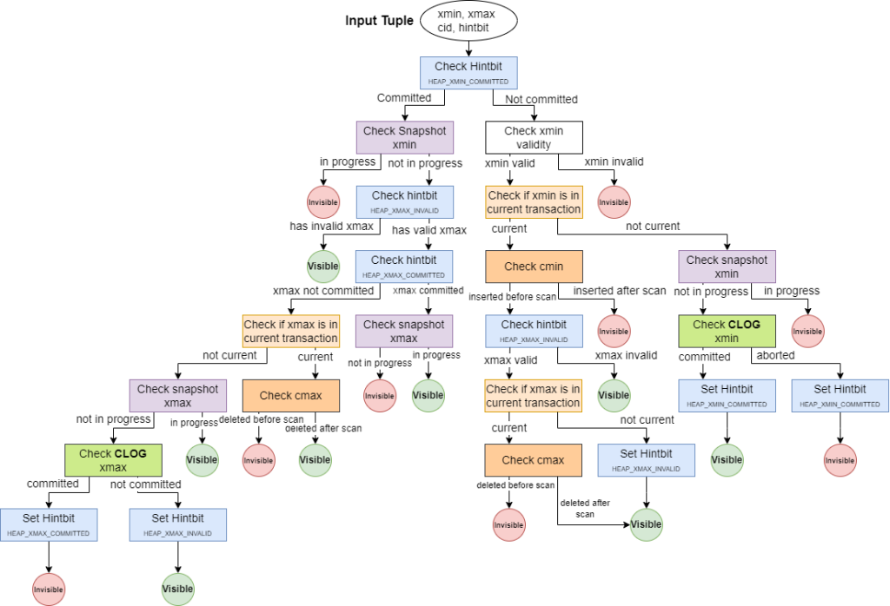

# Datafiles

## Folders

### Root

All databases folder are 
- stored in a folder named `base`
- pointed by 
  - $PGDATA environment variable
  - `data_directory` setting.

```postgresql
SELECT setting FROM pg_settings WHERE name = 'data_directory'
```
/var/lib/postgresql/data

Its content is (selected) the following.

| Item                 | Description                                                                   |
|----------------------|-------------------------------------------------------------------------------|
| PG_VERSION           | A file containing the major version number of PostgreSQL                      |
| base                 | Subdirectory containing per-database subdirectories                           |
| current_logfiles     | File recording the log file(s) currently written to by the logging collector  |
| pg_wal               | Subdirectory containing WAL (Write Ahead Log) files                           |
| pg_xact              | Subdirectory containing transaction commit status data                        |
| postgresql.auto.conf | A file used for storing configuration parameters that are set by ALTER SYSTEM |
| postmaster.pid       | A lock file recording the current postmaster process ID (PID))                |

[Postgresql doc](https://www.postgresql.org/docs/current/storage-file-layout.html)

### Database

All database files are stored
- under `base`
- in a folder, named with the database oid, eg. `16384` for database `database`.

```text
root@845f5da6d8e1:/# ls -ltrah /var/lib/postgresql/data/base/16384
```

## Files

### Table 

Relation = heap = table

Two relation cannot be stored in the same file.

Each relation is stored in **at least** one file on FS.

The filename is the relation oid, eg. `16433` for table `big_table`, followed by a dot if table exceeds 1 GB.

TODO: Update the example below
```text
root@845f5da6d8e1:/# ls -ltrah /var/lib/postgresql/data/base/16384/16385
-rw------- 1 postgres postgres 346M Dec 26 10:44 /var/lib/postgresql/data/base/16384/16385
```

To get the fragment under $PGDATA for a relation
```postgresql
SELECT  pg_relation_filepath('big_table')
```

You get.
```text
base/16384/16433
```

Which is.
```text
base/$DATABASE_OID/$TABLE_OID
```

Relation
```postgresql
SELECT *
FROM pg_class 
WHERE relname = 'big_table' and oid  = 16433
```

Database
```postgresql
SELECT *
FROM pg_database 
WHERE oid=16384 and datname = 'database'
```

In a container, you can get all files for a relation by executing
```postgresql
SELECT 'docker exec --tty postgresql bash -c ' || '"' || 'du -sh ' || setting || '/' ||  pg_relation_filepath('big_table') || '"'
FROM pg_settings WHERE name = 'data_directory';
```

#### Table content

##### Blocks

Each relation file is stored in several blocks (=pages), 8 kbytes each.
```postgresql
SHOW block_size;
```

[See below](#blocks)

##### Visibility map

##### Free space map

## Blocks

### Structure of a block 
[Postgresql doc](https://www.postgresql.org/docs/current/storage-page-layout.html)


| Item           | Description                                                                                                      |
|----------------|------------------------------------------------------------------------------------------------------------------|
| PageHeaderData | 24 bytes long. Contains general information about the page, including free space pointers.                       |
| ItemIdData     | Array of item identifiers pointing to the actual items. Each entry is an (offset,length) pair. 4 bytes per item. |
| Free space     | The unallocated space. New item identifiers are allocated from the start of this area, new items from the end.   |
| Items          | The actual items themselves.                                                                                     |
| Special space  | Index access method specific data. Different methods store different data. Empty in ordinary tables.             |


[Gary Evans](https://www.postgresql.fastware.com/pzone/2025-01-postgresql-row-storage)

Structure
- block header
- item pointers
- free space
- items (varying length)
- special space

With [reference to source code](https://medium.com/@nikolay_kudinov/understanding-postgresql-block-page-layout-part-1-cd1ad0b8d503)

### Structure of an item, aka table row

[Postgresql doc](https://www.postgresql.org/docs/current/storage-page-layout.html#STORAGE-TUPLE-LAYOUT)

Tuple (in the block), table row, aka item.


Item primary key is ctid.
Any item can be located by a pointer named `ctid` (aka CTID, Current Tuple Identifier)
> In fact, every pointer to an item (ItemPointer, also known as CTID) created by PostgreSQL consists of a page number and the index of an item identifier.
>  Because an item identifier is never moved until it is freed, its index can be used on a long-term basis to reference an item, even when the item itself is moved around on the page to compact free space.

But a row ctid maybe modified by VACUUM, so do not rely on it for batches.

[Postgresql doc](https://www.postgresql.org/docs/current/storage-page-layout.html#STORAGE-TUPLE-LAYOUT)

Their content is
> All table rows are structured in the same way. 
> There is : 
> - a header (fixed-size);
> - a null bitmap (optional);
> - an object ID (optional);
> - the user data. 

> The actual user data (columns of the row) begins at the offset indicated by t_hoff.

### Structure of row header, aka HeapTupleHeaderData

HeapTupleHeaderData Layout

[Postgresql docs](https://www.postgresql.org/docs/current/storage-page-layout.html#STORAGE-TUPLE-LAYOUT)


| Field       | Type            | Length  | Description                                           |
|-------------|-----------------|---------|-------------------------------------------------------|
| t_xmin      | TransactionId   | 4 bytes | insert XID stamp                                      |
| t_xmax      | TransactionId   | 4 bytes | delete XID stamp                                      |
| t_cid       | CommandId       | 4 bytes | insert and/or delete CID stamp (overlays with t_xvac) |
| t_xvac      | TransactionId   | 4 bytes | XID for VACUUM operation moving a row version         |
| t_ctid      | ItemPointerData | 6 bytes | current TID of this or newer row version              |
| t_infomask2 | uint16          | 2 bytes | number of attributes, plus various flag bits          |
| t_infomask  | uint16          | 2 bytes | various flag bits                                     |
| t_hoff      | uint8           | 1 byte  | offset to user data                                   |


Do not confuse
- `t_cid` :  Tuple / Command Identifier :  Tuple Command Id ?
- `t_ctid` : Tuple / Current Tuple Identifier


Its structure is `(block_number, offset)`.

```postgresql
SELECT 
    ctid,
    (ctid::text::point)[0]::bigint AS block
FROM versions
WHERE 1=1
--    AND ctid = '(0, 1)'
```
There are 2 tuples, all in the same block (0) at offset 1 and 2

| ctid  |
|:------|
| (0,1) |
| (0,2) |


### peek into blocks: pageinspect

[See also](https://www.postgresql.fastware.com/pzone/2025-01-postgresql-row-storage)


To display the block content:
- header
- its tuple

> All tuples are shown, whether the tuples were visible to an MVCC snapshot at the time the raw page was copied.

#### Display all but data

Activate extension
```postgresql
CREATE EXTENSION pageinspect;
```

Create a table
```postgresql
DROP TABLE IF EXISTS versions;
CREATE TABLE versions (id INTEGER, version INTEGER);
```

Disable auto-vacuum, which launch auto-freeze
```postgresql
ALTER TABLE versions SET (autovacuum_enabled = off);
```

Create a version
```postgresql
INSERT INTO versions (id, version) VALUES (1, 1); 
INSERT INTO versions (id, version) VALUES (1, 2); 
INSERT INTO versions (id, version) VALUES (1, 63); 
INSERT INTO versions (id, version) VALUES (1, 64); 
INSERT INTO versions (id, version) VALUES (1, 65); 
INSERT INTO versions (id, version) VALUES (1, 66);

--ANALYZE versions;
--VACUUM FREEZE versions;
```

Tuples pointers, with tuple data as single value
From block 0 (2nd parameter of `get_raw_page`)
```postgresql
SELECT
    (pnt.t_ctid::text::point)[0]::bigint AS block
   ,pnt.lp     line_pointer
   ,pnt.t_ctid tuple_identifier
   ,pnt.t_xmin
   ,pnt.t_xmax
   ,pnt.t_data
   ,'heap_page_items=>' 
   ,pnt.*
FROM heap_page_items(
        get_raw_page('versions', 0)
) pnt;
``` 

| block | line_pointer | tuple_identifier | t_xmin | t_xmax | t_data             |
|:------|:-------------|:-----------------|:-------|:-------|:-------------------|
| 0     | 1            | (0,1)            | 782    | 0      | 0x0100000001000000 |
| 0     | 2            | (0,2)            | 783    | 0      | 0x0100000002000000 |
| 0     | 3            | (0,3)            | 784    | 0      | 0x010000003F000000 |
| 0     | 4            | (0,4)            | 785    | 0      | 0x0100000040000000 |
| 0     | 5            | (0,5)            | 787    | 0      | 0x0100000041000000 |
| 0     | 6            | (0,6)            | 788    | 0      | 0x0100000042000000 |
| 0     | 7            | (0,7)            | 789    | 0      | 0x0100000042000000 |


Tuples pointers, with tuple data in columns ?
```postgresql
SELECT * 
FROM 
  heap_page_item_attrs(
        get_raw_page('versions', 0), 
        'versions'::regclass,
        TRUE);
```

Tuples data
```postgresql
SELECT 
    tuple_data_split('versions'::regclass, t_data, t_infomask, t_infomask2, t_bits) 
FROM 
    heap_page_items(
            get_raw_page('versions', 0)
    );
```

| tuple_data_split        |
|:------------------------|
| {0x01000000,0x01000000} |
| {0x01000000,0x02000000} |
| {0x01000000,0x3F000000} |
| {0x01000000,0x40000000} |
| {0x01000000,0x41000000} |
| {0x01000000,0x42000000} |
| {0x01000000,0x42000000} |


#### Decode data (manually)

[Postgresql doc](https://www.postgresql.org/docs/current/storage-page-layout.html#STORAGE-TUPLE-LAYOUT)
> Interpreting the actual data can only be done with information obtained from other tables, mostly pg_attribute. The key values needed to identify field locations are attlen and attalign. There is no way to directly get a particular attribute, except when there are only fixed width fields and no null values. All this trickery is wrapped up in the functions heap_getattr, fastgetattr and heap_getsysattr.

```postgresql
DROP TABLE IF EXISTS versions;
CREATE TABLE versions (id INTEGER);
```

Create a version
```postgresql
TRUNCATE TABLE versions;
INSERT INTO versions (id) VALUES (1);        --2^0 
INSERT INTO versions (id) VALUES (2);        --2 * 2^0 
INSERT INTO versions (id) VALUES (256);      --2^8
INSERT INTO versions (id) VALUES (65536);    --2^16 
INSERT INTO versions (id) VALUES (16777216); --2^24
```

```postgresql
SELECT 
    2^0,
    2^8,
    2^16,
    2^24;
```

Tuples data.


[See this](https://andreas.scherbaum.la/post/2022-06-28_ctid-and-other-postgresql-table-internals/#ctid)

You need to know how data is stored:
- each INTEGER is 4 bytes

```postgresql
SELECT
    id.value raw,
    id.id_first_byte * 2^0 +
    id.id_second_byte * 2^8 +
    id.id_third_byte * 2^16 +
    id.id_fourth_byte * 2^24 value
FROM( 
    SELECT
        tuple.tuple_data_split[1] value,
        get_byte(tuple.tuple_data_split[1], 0) id_first_byte, 
        get_byte(tuple.tuple_data_split[1], 1) id_second_byte, 
        get_byte(tuple.tuple_data_split[1], 2) id_third_byte,
        get_byte(tuple.tuple_data_split[1], 3) id_fourth_byte    
    FROM (
        SELECT 
            tuple_data_split('versions'::regclass, t_data, t_infomask, t_infomask2, t_bits) 
        FROM 
            heap_page_items(
                    get_raw_page('versions', 0)
            )
        ) tuple 
) id
ORDER BY id.value DESC
```


2 integer ?
```postgresql
SELECT
    tuple.tuple_data_split[1],
    get_byte(tuple.tuple_data_split[1], 0) id, 
    get_byte(tuple.tuple_data_split[2], 0) version
FROM (
    SELECT 
        tuple_data_split('versions'::regclass, t_data, t_infomask, t_infomask2, t_bits) 
    FROM 
        heap_page_items(
                get_raw_page('versions', 0)
        )) tuple;
```


#### item (tuple, row) flags

##### How to interpret flags/bit/hints

###### what are they ?

They are here for MVCC optimization
- no consecutive lookup in CLOG for same item
- event if CLOG is [in cache](https://www.interdb.jp/pg/pgsql05/04.html) , and https://www.interdb.jp/pg/pgsql05/04.html

Sources
- https://medium.com/@nikolaykudinov/understanding-postgresql-block-page-layout-part-2-6e61b7af6667
- https://medium.com/@nikolaykudinov/understanding-postgresql-block-page-layout-part-3-517e567079ee

List
- `HEAP_XMIN_COMMITTED` meaning PostgreSQL marked the tuple as committed

[Broader view](https://www.highgo.ca/2024/04/19/a-deeper-look-inside-postgresql-visibility-check-mechanism)
- row header
- CLG
- snapshot

> hintbit: this is a flag field that stores the query results from CLOG so PostgreSQL does not have to look up CLOG all the time.
> if hintbit has HEAP_XMIN_COMMITTED set, this means that the transaction ID that inserts this tuple (a.k.a xmin) is committed





###### when are they set ?
 
>Hint bit updates
>As we saw in the last example, this leaves row versions that were modified by a previous transaction in an ambiguous state: is a particular tuple visible or not? Put differently: was the transaction that made a change to the tuple committed or not? The server has to consult the commit log to answer this question.
> Once answered, any statement accessing tuples in such a state sets the hint bits in the infomask on the relevant tuple headers to record the answer - you see where this is going. This way the ambiguity about a tuple's visibility is resolved for subsequent statements which avoids the extra check of the commit log.

> Recording this answer can cause a write by a simple SELECT query.

> By SELECTing the entire table, we of course had to read from the single page stored in shared buffers (hit=1),
> and, crucially, while doing so we "dirtied" the page which means that our statement modified the page
> Buffers: shared hit=1 dirtied=1 
> Another SELECT does not dirty the page again:
> Buffers: shared hit=1
[Source](https://jesipow.com/blog/postgres-reads-cause-writes/)

###### page-pruning (irrelevant)

Remove the item data, not the pointer 
`lp_flags=redirect`

> The pruning process can, in principle, be triggered by any statement accessing a heap page. But even though it is a fairly lightweight process, it would still be expensive to attempt pruning every single time a page is accessed. Instead, it is only triggered when available space in a page is limited.

https://jesipow.com/blog/postgres-reads-cause-writes/#page-pruning

###### all useful ?

[All useful ?](https://postgrespro.com/list/thread-id/1811019)

##### get them

Tuple flags
```postgresql
SELECT 
    tuple.t_ctid, 
    tuple.t_infomask::text || tuple.t_infomask2::text flags_encoded,
    flag.raw_flags flags_decoded, 
    flag.combined_flags flags_decoded_combined
FROM heap_page_items(get_raw_page('versions', 0)) tuple,
           LATERAL heap_tuple_infomask_flags(tuple.t_infomask, tuple.t_infomask2) flag
WHERE 1=1
    AND tuple.t_infomask IS NOT NULL OR t_infomask2 IS NOT NULL
    --AND flag.raw_flags::TEXT LIKE '%HEAP_XMIN_COMMITTED%' -- does not mean all-visible !
```


#### item flags : frozen

To set frozen
```postgresql
VACUUM FREEZE versions;
```

Tuple flags, eg `frozen`
Combined
```postgresql
SELECT 
    i.t_ctid, 
    t.raw_flags, 
    t.combined_flags
FROM heap_page_items(get_raw_page('versions', 0)) i,
           LATERAL heap_tuple_infomask_flags(t_infomask, t_infomask2) t
WHERE t_infomask IS NOT NULL OR t_infomask2 IS NOT NULL;
```

| t_ctid | combined_flags     |
|:-------|:-------------------|
| (0,1)  | {HEAP_XMIN_FROZEN} |
| (0,2)  | {HEAP_XMIN_FROZEN} |
| (0,3)  | {HEAP_XMIN_FROZEN} |
| (0,4)  | {HEAP_XMIN_FROZEN} |
| (0,5)  | {HEAP_XMIN_FROZEN} |


#### HOT : heap_page_items.t_infomask.lp_flags


[Source](https://github.com/postgres/postgres/blob/master/src/include/access/htup_details.h)
```postgresql
SELECT '(0,'||lp||')' AS ctid,
       CASE lp_flags
         WHEN 0 THEN 'unused'
         WHEN 1 THEN 'normal'
         WHEN 2 THEN 'redirect to '||lp_off
         WHEN 3 THEN 'dead'
       END AS state,
       t_xmin as xmin,
       t_xmax as xmax,
       (t_infomask & 256) > 0  AS xmin_commited,
       (t_infomask & 512) > 0  AS xmin_aborted,
       (t_infomask & 1024) > 0 AS xmax_commited,
       (t_infomask & 2048) > 0 AS xmax_aborted,
       t_ctid
FROM heap_page_items(get_raw_page('mytable',0))
WHERE 1=1
-- AND t_xmax <> 0 -- not yet visible
;
```


#### Structure

Structure
- block header
- item pointers
- free space
- items (varying length)
- special space

https://www.postgresql.fastware.com/pzone/2025-01-postgresql-row-storage

```postgresql
SELECT
    'item'    
    ,itm.lp_off offset_fom_special
    ,itm.lp_len data_length
    ,item.t_hoff offset_data
FROM 
    heap_page_items(get_raw_page('mytable',0)) itm
WHERE 1=1
-- AND t_xmax <> 0 -- not yet visible
;
```

### peek into datafile: pg_filedump

[Install](https://devopsideas.com/postgresql-internals-a-practical-guide-to-pg_filedump/)

[Use](https://www.dbi-services.com/blog/displaying-the-contents-of-a-postgresql-data-file-with-pg_filedump/)


### peek into indexes blocks: pageinspect

[Source](https://www.postgresql.fastware.com/pzone/2025-01-understanding-the-mechanics-of-postgresql-b-tree-indexes)

[Check code here](../../queries/shrink_table/consecutive-inserts.md)